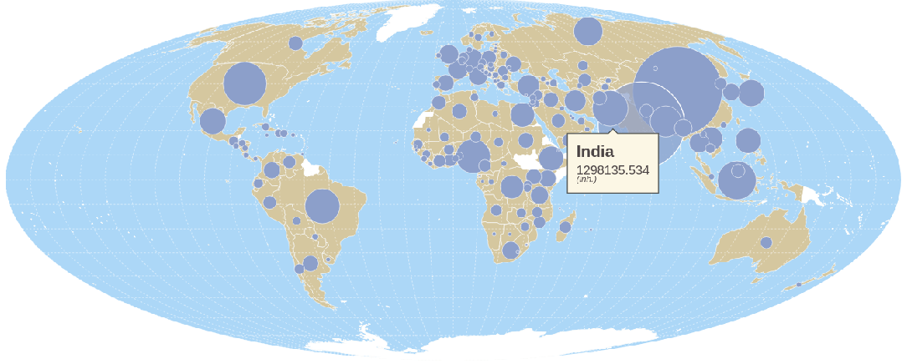

# bertin

***An easy to use wrapper around d3js to facilitate the process of making thematic maps***



### Why Bertin ?

Jacques Bertin (1918 - 2010) is a French cartographer, whose work on "graphic semiology" has been crucial....

## Testing phase

> npm publish --dry-run

https://observablehq.com/d/4113b173ec452c29

## 1. Installation

### ➡️ In browser

```html
<script src="index.min.js" charset="utf-8"></script>
```

### ➡️ In observable

~~~js
bertin = require("https://bundle.run/bertin@0.0.34")
~~~

## 2. How to use?

### ➡️ Sample data

*data.csv* contains population and GDP data for the different countries of the world. The data is from the [World Bank](https://data.worldbank.org/) database and downloaded in December 2021. Each time it is the last known year.

*world.geojson* is a basemap of the countries of the world from the project [Magrit](http://magrit.cnrs.fr/).

### ➡️ In browser

~~~js
<script src="https://cdn.jsdelivr.net/npm/d3@7"></script>
<script src="https://cdn.jsdelivr.net/npm/d3-geo-projection@4"></script>
<script src="http://localhost/npm_test/bertin/index.min.js"></script>

<script>

let geojson =   "./world.geojson"

d3.json(geojson).then(r =>
document.body.appendChild(bertin.plot({
  params: {
    projection: d3.geoVanDerGrinten4()
  },
  layers: [
      {type: "layer", geojson: r,  tooltip: ["ISO3", "NAMEen", ""] },
      {type:"outline"},
      {type:"graticule"}
    ]
})));

</script>
~~~

### ➡️ In Observable

~~~js
d3 = require("d3@7", "d3-geo-projection@4")
~~~

~~~js
bertin = require("https://bundle.run/bertin@0.0.34")
~~~

~~~js
countries = d3.json(
  "https://gisco-services.ec.europa.eu/distribution/v2/countries/geojson/CNTR_RG_60M_2020_4326.geojson"
)
~~~

~~~js
bertin.plot({
  params: {
    projection: d3.geoBertin1953()
  },
  layers: [
    {
      type: "layer",
      geojson: countries,
      fill: "#e6acdf",
      tooltip: ["CNTR_ID", "CNTR_NAME", ""]
    },

    { type: "outline" },
    { type: "graticule", step: [0, 90], stroke: "blue", strokewidth: 2 }
  ]
})
~~~


### ➡️ Tutorials

https://observablehq.com/d/8fc1cb198f9d1017?collection=@neocartocnrs/bertin

## 3. Documentation

<b>plot</b>() is the main function of the library. It allows you to make various thematic maps. It allows to display and overlay different types of layers listed below. The layers written on top are displayed first.
Plot is the main function of the library. It allows you to make various thematic maps. It allows to display and overlay different types of layers listed below. The layers written on top are displayed first.

#### Global parameters

In section *params* we define the global parameters of the map: its size, projection, background color, etc. To have access to a large number of projections, you will need to load the [d3-geo-projection@4](https://github.com/d3/d3-geo-projection) library. This section is optional.

~~~js
bertin.plot({
  params: {
    projection: d3.geoBertin1953(),
    width: 750,
  },
  layers: [...]
})
~~~

<details><summary>See parameters</summary>

- <b>projection</b>: a function defining the map projection. Cf d3-geo-projection@4 (default: d3.geoPatterson())
- <b>width</b>: width of the map (default:1000);
- <b>extent</b>: a feature defing the extent e.g. a country (default: null)
- <b>margin</b>: margin around features to be displayed. This option can be usefull if the stroke is very heavy (default: 1)
- <b>background</b>: color of the background (default:"none")

</details>

#### footer

Lorem ipsum dolor sit amet, consectetur adipiscing elit, sed do eiusmod tempor incididunt ut labore et dolore magna aliqua. Ut enim ad minim veniam, quis nostrud exercitation ullamco. [Source](https://github.com/neocarto/bertin/blob/main/src/footer.js).

~~~js
bertin.plot({
  layers: [{
        type: "footer",
        text: "Source: Worldbank, 2021",
        fontsize: 10
  }]
})
~~~

<details><summary>See parameters</summary>

- <b>text</b>: text to be displayed (default:"")
- <b>anchor</b>: text anchor. start, middle, end (default:"end")
- <b>fontsize</b>: size of the text (default:15)
- <b>fill</b>: color of the text (default:"#9e9696")
- <b>background</b>: background color (default: "white")
- <b>backgroundopacity</b>: background opacity (default: 1)

</details>


#### Graticule

Lorem ipsum dolor sit amet, consectetur adipiscing elit, sed do eiusmod tempor incididunt ut labore et dolore magna aliqua. Ut enim ad minim veniam, quis nostrud exercitation ullamco.[Source](https://github.com/neocarto/bertin/blob/main/src/graticule.js).

~~~js
bertin.plot({
  layers: [{
        type: "graticule",
        fill: "#644580",
        step:[20,10]
  }]
})
~~~

<details><summary>See parameters</summary>

- <b>stroke</b>: stroke color (default:"white")
- <b>strokewidth</b>: stroke width (default:0.8)
- <b>strokeopacity</b>: stroke opacity (default:0.5)
- <b>strokedasharray</b>stroke-dasharray (default:2)
- <b>step</b>: gap between graticules. The value can be a number or an array of two values (default:[10, 10])

</details>


#### header

Lorem ipsum dolor sit amet, consectetur adipiscing elit, sed do eiusmod tempor incididunt ut labore et dolore magna aliqua. Ut enim ad minim veniam, quis nostrud exercitation ullamco. [Source](https://github.com/neocarto/bertin/blob/main/src/header.js).

~~~js
bertin.plot({
  layers: [{
        type: "header",
        text: "Title of the map",
        fontsize: 40
  }]
})
~~~

<details><summary>See parameters</summary>

- <b>text</b>: text to be displayed (default:"")
- <b>anchor</b>: text anchor. start, middle, end (default:"middle")
- <b>fontsize</b>: size of the text (default:20)
- <b>fill</b>: color of the text (default:"#9e9696")
- <b>background</b>: background color (default: "white")
- <b>backgroundopacity</b>: background opacity (default: 1)

</details>

#### Layer

Lorem ipsum dolor sit amet, consectetur adipiscing elit, sed do eiusmod tempor incididunt ut labore et dolore magna aliqua. Ut enim ad minim veniam, quis nostrud exercitation ullamco.[Source](https://github.com/neocarto/bertin/blob/main/src/layer-simple.js). [Example](https://observablehq.com/d/d59855d7cc99f6e5?collection=@neocartocnrs/bertin)

~~~js
bertin.plot({
  layers: [
    {
      type: "layer",
      geojson: *a geojson here*,
      fill: "#e6acdf",
      tooltip: ["CNTR_ID", "CNTR_NAME", ""]
    }
  ]
})
~~~

<details><summary>See parameters</summary>

- <b>geojson</b>: a geojson (<ins>compulsory<ins>)
- <b>fill</b>: fill color (default: a random color)
- <b>stroke</b>: stroke color (default: "white")
- <b>strokewidth</b> stroke width (default:0.5)
- <b>fillopacity</b>: fill opacity (default:1)
- <b>tooltip</b> an array of 3 values defing what to display within the tooltip. The two first values indicates the name of a field in properties. the third value is a string to indicates the unit (default:"")

Parameters of the legend

- <b/>leg_x</b>: position in x (if this value is not filled, the legend is not displayed)
- <b/>leg_y</b>: position in y (if this value is not filled, the legend is not displayed)
- <b>leg_w</b>: width of the bof (default: 30)
- <b>leg_h</b>: height of the bof (default:20)
- <b/>leg_title</b>: title of the legend (default; null)
- <b>leg_text</b>: text of the box (default: "text of the box")
- <b/>leg_fontsize</b>: title legend font size (default: 14)
- <b/>leg_fontsize2</b>: values font size (default: 10)
- <b/>leg_fill</b>: color of the box (same as the layer displayed)
- <b/>leg_stroke</b>: stroke of the box (default: "black")
- <b/>leg_strokewidth</b>: stroke-width (default: 0.5)
- <b>leg_fillopacity</b>: stroke opacity (same as the layer displayed)
- <b/>leg_txtcol</b>: color of the texte (default: "#363636")

</details>

#### Match

Function to evaluate the quality of a join between the data and the background map. It returns a chart. [Source](https://github.com/neocarto/bertin/blob/main/src/match.js) [Example](https://observablehq.com/d/608ed06a679bfeca)

~~~js
let testjoin = bertin.match(countries, "ISO3_CODE", maddison, "countrycode")
~~~

*.matched* returns an array containing matched ids

~~~js
testjoin.matched
~~~

*.matched_data* returns an array containing matched data ids

~~~js
testjoin.matched_data
~~~

*.unmatched_data* returns an array containing unmatched data ids

~~~js
testjoin.unmatched_data
~~~

*.unmatched_geom* returns an array containing unmatched geom ids

~~~js
testjoin.unmatched_geom
~~~

<details><summary>See parameters</summary>

- <b>geojson</b>: a geojson (<ins>compulsory<ins>)
- <b/>id_geojson</b>: a string corresponding to the identifier of the features in the properties (<ins>compulsory<ins>)
- <b/>data</b>: a geoj (<ins>compulsory<ins>)
- <b/>id_data</b>: a string corresponding to the identifier of the features (<ins>compulsory<ins>)

</details>


#### Missing

Sometimes, when making a map by proportional symbols for example, it can be interesting to display in white under the symbols, the countries with missing data. That's what this function is for. [Source](https://github.com/neocarto/bertin/blob/main/src/layer-missing.js).

~~~js
plot({
  layers: [
    {
      type: "missing",
      geojson: countries,
      id_geojson: "ISO3_CODE",
      data: maddison,
      id_data: "countrycode",
      var_data: "pop"
  ]
})
~~~

<details><summary>See parameters</summary>

- <b/>geojson</b>: a geojson (<ins>compulsory<ins>)
- <b/>data</b>: a geoj (<ins>compulsory<ins>)
- <b/>id_geojson</b>: a string corresponding to the identifier of the features in the properties (<ins>compulsory<ins>)
- <b/>id_data</b>: a string corresponding to the identifier of the features (<ins>compulsory<ins>)
- <b/>var_data</b>: a string corresponding to the targeted variable (<ins>compulsory<ins>)
- <b/>fill</b>: fill color (default: "white")
- <b/>stroke</b>: stroke color (default: "white")
- <b/>strokewidth</b>: stroke width (default: 0.5)
- <b/>fillopacity</b>: fill opacity (default: 1)

Parameters of the legend

- <b/>leg_x</b>: position in x (if this value is not filled, the legend is not displayed)
- <b/>leg_y</b>: position in y (if this value is not filled, the legend is not displayed)
- <b>leg_w</b>: width of the bof (default: 30)
- <b>leg_h</b>: height of the bof (default:20)
- <b>leg_text</b>: text of the box (default: "text of the box")
- <b/>leg_fontsize</b>: text font size (default: 10)
- <b/>leg_fill</b>: color of the box (same as the layer displayed)
- <b/>leg_stroke</b>: stroke of the box (default: "black")
- <b/>leg_strokewidth</b>: stroke-width (default: 0.5)
- <b>leg_fillopacity</b>: stroke opacity (same as the layer displayed)
- <b/>leg_txtcol</b>: color of the texte (default: "#363636")

</details>

#### Outline

Lorem ipsum dolor sit amet, consectetur adipiscing elit, sed do eiusmod tempor incididunt ut labore et dolore magna aliqua. Ut enim ad minim veniam, quis nostrud exercitation ullamco.[Source](https://github.com/neocarto/bertin/blob/main/src/outline.js).

~~~js
bertin.plot({
  layers: [{
        type: "outline",
        fill: "#4269ad"
  }]
})
~~~

<details><summary>See parameters</summary>

- <b>fill</b>: fill color of the outline (default: "#add8f7")
- <b>stroke</b>: stroke color (default:"none")
- <b>strokewidth</b>: stroke width (default: 1)

</details>

#### Prop

Fonction pour creer une couche par symboles proportionnels [Source](https://github.com/neocarto/bertin/blob/main/src/layer-prop.js)

~~~js
  plot({
    layers: [
      {
        type: "prop",
        geojson: countries,
        id_geojson: "ISO3_CODE",
        data: maddison,
        id_data: "countrycode",
        var_data: "pop",
        k: 60,
        tooltip: ["country", "pop", "(inh.)"]
    ]
  })
~~~

<details><summary>See parameters</summary>

- <b/>geojson</b>: a geojson (<ins>compulsory<ins>)
- <b/>data</b>: a geoj (<ins>compulsory<ins>)
- <b/>id_geojson</b>: a string corresponding to the identifier of the features in the properties (<ins>compulsory<ins>)
- <b/>id_data</b>: a string corresponding to the identifier of the features (<ins>compulsory<ins>)
- <b/>var_data</b>: a string corresponding to the targeted variable (<ins>compulsory<ins>)
- <b/>k</b>: size of the largest circle (defaul:50)
- <b/>fill</b>: fill color (default: random color)
- <b/>stroke</b>: stroke color (default: "white")
- <b/>strokewidth</b>: stroke width (default: 0.5)
- <b/>fillopacity</b>: fill opacity (default: 1)
- <b>tooltip</b> an array of 3 values defing what to display within the tooltip. The two first values indicates the name of a field in properties. the third value is a string to indicates the unit (default:"")

Parameters of the legend

- <b/>leg_x</b>: position in x (if this value is not filled, the legend is not displayed)
- <b/>leg_y</b>: position in y (if this value is not filled, the legend is not displayed)
- <b/>leg_fill</b>: color of the circles (default: "none")
- <b/>leg_stroke</b>: stroke of the circles (default: "black")
- <b/>leg_strokewidth</b>: stoke-width (default: 0.8)
- <b/>leg_txtcol</b>: color of the texte (default: "#363636")
- <b/>leg_title</b>: title of the legend (default var_data)
- <b/>leg_round</b>: number of digits after the decimal point (default: undefined)
- <b/>leg_fontsize</b>: title legend font size (default: 14)
- <b/>leg_fontsize2</b>: values font size (default: 10)

</details>

#### Scalebar

This function allows you to display a sclaebar on the map [Source](https://github.com/neocarto/bertin/blob/main/src/scalerbar.js)

  ~~~js
  plot({
    layers: [
      {
        type: "scalebar",
        units: "miles"
      },
    ]
  })
  ~~~

<details><summary>See parameters</summary>

- <b/>x</b>: position in x (if this value is not filled, the legend is displayed on the left)
- <b/>y</b>: position in x (if this value is not filled, the legend is displayed at the bottom)
- <b/>units</b>: distance unit, miles or kilometers (default: "kilimeters")

</details>

#### Shadow

This function allows you to display a shadow under a layer to give it a relief effect [Source](https://github.com/neocarto/bertin/blob/main/src/shadow.js)

~~~js
plot({
  layers: [
    {
      type: "shadow",
      geojson: JPN,
      dx: 5,
      dy: 5
    },
  ]
})
~~~

<details><summary>See parameters</summary>

- <b>col</b>: color (default: "#35383d")
- <b>dx</b>: shift in x (default: 3)
- <b>dy</b>: shift in y (default: 3)
- <b>stdDeviation</b> blur (default: 1.5)
- <b>opacity</b>: opacity (default: 0.7)

</details>

#### Texts

Lorem ipsum dolor sit amet, consectetur adipiscing elit, sed do eiusmod tempor incididunt ut labore et dolore magna aliqua. Ut enim ad minim veniam, quis nostrud exercitation ullamco. [Source](https://github.com/neocarto/bertin/blob/main/src/text.js). [Example](https://observablehq.com/d/95fcfac18b213daf?collection=@neocartocnrs/bertin).

~~~js
bertin.plot({
  layers: [
    {
      type: "text",
      text: "bottomright",
      position: "bottomright",
      fontsize: 20,
      baseline: "middle",
      frame_stroke: "red",
      margin: 4
    }
  ]
})
~~~

<details><summary>See parameters</summary>

- <b>position</b>: position of the text. It can be an array with x,y coordinates. For example [100,200]. It can be also a string defining the position. "topleft", "top", "topright", "left", "middle", "right", "bottomleft", "bottom", "bottomright" (default: "topleft")
- <b>text</b>: text to display. With the backticks, it is possible to display a text on several lines (default: "Your text here!")
- <b>fontsize</b>: text size (default: 15)
- <b>margin</b>: margin around the text (default: 0)
- <b>anchor</b>: text anchor. start, middle, end (default: "start")
- <b>baseline</b>: alignment baseline. "baseline", "middle", "hanging" (default:"hanging")
- <b>fill</b>: text color (default: "#474342")
- <b>stroke</b>: stroke color (default: "none")
- <b>frame_fill</b>: frame background color (default:"none")
- <b>frame_stroke</b>: frame stroke color (default: "none")
- <b>frame_strokewidth</b>: thickness of the frame contour (default: 1)
- <b>frame_opacity</b>: frame opacity (default: 1)

</details>

#### Typo

Fuction to create a typology map [Source](https://github.com/neocarto/bertin/blob/main/src/layer-typo.js)

~~~js
  plot({
    layers: [
      {
        type: "typo",
        geojson: countries,
        id_geojson: "ISO3_CODE",
        data: maddison,
        id_data: "countrycode",
        var_data: "region"
    ]
  })
~~~

<details><summary>See parameters</summary>

- <b/>geojson</b>: a geojson (<ins>compulsory<ins>)
- <b/>data</b>: a geoj (<ins>compulsory<ins>)
- <b/>id_geojson</b>: a string corresponding to the identifier of the features in the properties (<ins>compulsory<ins>)
- <b/>id_data</b>: a string corresponding to the identifier of the features (<ins>compulsory<ins>)
- <b/>var_data</b>: a string corresponding to the targeted variable (<ins>compulsory<ins>)
- <b>colors</b>: An array containig n colos for n types (defaut: null)
- <b>pal</b>: a palette of categorical colors (default: "Tableau10") [See](https://observablehq.com/@d3/color-schemes)
- <b>col_missing</b>: Color for missing values (default "#f5f5f5")
- <b>stroke</b>: sreoke color (default: "white")
- <b>strokewidth</b>: Stroke width (default: 0.5)
- <b>fillopacity</b>: Fill opacity (dafault: 1)
- <b>tooltip</b>: - <b>tooltip</b> an array of 3 values defing what to display within the tooltip. The two first values indicates the name of a field in properties. the third value is a string to indicates the unit (default:"")

</details>
