[](https://observablehq.com/@neocartocnrs/bertin-logo)


**Bertin.js** is a JavaScript library for visualizing geospatial data and make thematic maps for the web.

_The project is under **active development**. Some of features and options are subject to change. We welcome contributions of all kinds: bug reports, code contributions and documentation._


- [Introduction](https://observablehq.com/@neocartocnrs/hello-bertin-js)
- [Who is Bertin?](#who-is-bertin)
- [Installation](#installation)
- [Usage](#usage)
- [Drawing a map](#drawing-a-map)
- [Map types](#map-types)
- [Map components](#map-components)
- [Custom Layer](#custom-layer)
- [Geojson properties selections](#geojson-properties-selections)
- [Other functions](#other-functions)

`bertin` is an easy to use JavaScript library mainly based on [D3.js](https://github.com/d3/d3) makes creating thematic maps simple. The principle is to work with layers stacked on top of one other. Much like in Geographic Information Software (GIS) software, Bertin.js displays layers with a specific hierarchy. The layer at bottom are rendered and then followed by the layer right above it. Some of the layers are used to display various components of a map, some of common layers are: header, footer, graticule, outline, choro, typo, prop, shadow, scalebar, text etc.

## Who is Bertin?

Jacques Bertin (1918-2010) was a French cartographer, whose major contribution was a theoretical and practical reflection on all graphic representations (diagrams, maps and graphs), forming the subject of a fundamental treatise, Graphic Semiology, originally published in 1967. Bertin's influence remains strong not only in academics, teaching of cartography today, but also among statisticians and data visualization specialists.

## Installation

#### In browser

Latest major version

```html
<script src="https://cdn.jsdelivr.net/npm/bertin@1" charset="utf-8"></script>
```

Latest version

```html
<script
  src="https://cdn.jsdelivr.net/npm/bertin@1.5.0"
  charset="utf-8"
></script>
```

#### In Observable

Latest major version

```js
bertin = require("bertin@1");
```

Latest version

```js
bertin = require("bertin@1.5.0");
```

#### In Quarto

In [Quarto](https://quarto.org/), you can use `bertin` with ojs cells. This allows to combine analyses in R or Python with visualizations made with `bertin`. An example is available [here](https://neocarto.github.io/bertin/examples/quarto.html)

## Usage

#### In browser

```html
<script src="https://cdn.jsdelivr.net/npm/d3@7"></script>
<script src="https://cdn.jsdelivr.net/npm/bertin@1.5.0"></script>

<script>
  let geojson =
    "https://raw.githubusercontent.com/neocarto/bertin/main/data/world.geojson";

  d3.json(geojson).then((r) =>
    document.body.appendChild(
      bertin.draw({
        params: {
          projection: "VanDerGrinten4",
          clip: true,
        },
        layers: [
          { geojson: r, tooltip: ["$ISO3", "$NAMEen"] },
          { type: "outline" },
          { type: "graticule" },
        ],
      })
    )
  );
</script>
```

See examples: [Example 1](https://neocarto.github.io/bertin/examples/example1.html), [Example 2](https://neocarto.github.io/bertin/examples/example2.html) and [Example 3](https://neocarto.github.io/bertin/examples/example3.html).

#### In Observable Notebook

The bertin.js library is really easy to use within an Observable notebook. You'll find many examples in [this notebook collection](https://observablehq.com/collection/@neocartocnrs/bertin). Feel free to fork, copy, modify with your own data.

[](https://observablehq.com/collection/@neocartocnrs/bertin)

## Drawing a map

**draw**() is the main function of the library. It allows you to make various thematic maps. It allows to display and overlay different types of layers listed below. The layers written on top are displayed first. [Source](https://github.com/neocarto/bertin/blob/main/src/draw.js) [Example](https://observablehq.com/@neocartocnrs/hello-bertin-js)

### Global parameters

In the section _params_, we define the global parameters of the map: its size, projection, background color, etc. To have access to a large number of projections, you will need to load the [d3-geo-projection@4](https://github.com/d3/d3-geo-projection) library. This section is optional.

#### Code

```js
bertin.draw({
  params: {
    projection: d3.geoBertin1953(),
    width: 750,
  },
  layers: [...]
})
```

#### Parameters

- **projection**: a d3 function or string defining the map projection. Refer [d3-geo-projection](https://github.com/d3/d3-geo-projection) and [spatialreference.org](https://spatialreference.org/) for more detailed explanation. (default: d3.geoEquirectangular() except if you use tiles. in this case, the projection is automatically set to d3.geoMercator()). Moreover, if you define projection as "user", you can display a basemap already projected. [Example](https://observablehq.com/@neocartocnrs/bertin-js-projections). Note alsa that custom projections are available. Try "Polar", "Spilhaus" or "HoaXiaoguang".
- **width**: width of the map (default:1000);
- **extent**: a feature or a bbox array defining the extent e.g. a country or [[112, -43],[153, -9]] (default: null)
- **margin**: margin around features to be displayed. This option can be useful if the stroke is very heavy (default: 1)
- **background**: color of the background (default: "none")
- **clip**: a boolean to avoid artifacts of discontinuous projection (default: "false")
- **reverse**: a boolean. By default, the layer placed on the top of the code is display on the top of the map. With reverse = true, your can reverse this order (default: false).

## Map types

### Simple layer

The _layer_ type allows to display a simple geojson layer (points, lines or polygons). [Source](https://github.com/neocarto/bertin/blob/main/src/layers/simple.js). [Example 1](https://observablehq.com/@neocartocnrs/hello-bertin-js) and [Example 2](https://observablehq.com/@neocartocnrs/bertin-js-symbols?collection=@neocartocnrs/bertin).

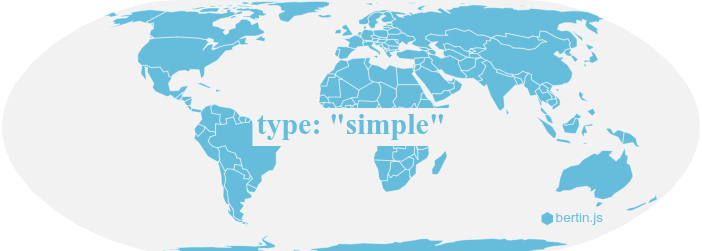


#### Code

```js
bertin.draw({
  layers: [
    {
      type: "layer",
      geojson: *a geojson here*,
      fill: "#e6acdf",
    }
  ]
})
```

#### Parameters

- **geojson**: a geojson (**compulsory**)
- **fill**: fill color (default: a random color)
- **stroke**: stroke color (default: "white")
- **strokeWidth** stroke width (default:0.5)
- **strokeLinecap**: stroke-linecap (default:"round")
- **strokeLinejoin**: stroke-linejoin (default:"round")
- **strokeDasharray**: stroke-dasharray (default:"none")
- **fillOpacity**: fill opacity (default:1)
- **strokeOpacity**: stroke opacity (default:1)
- **symbol**: if it is a dot layer, the type of symbol. "circle", "cross", "diamond", "square", "star", "triangle", "wye" (default: "circle")
- **symbol_size**: if it is a dot layer, a number indicating the size of the symbol (default: 5)
- **symbol_shift**: if it is a dot layer, use a value > 0 to switch symbols and avoid overlay (default: 0)
- **symbol_iteration**: Number of iteration to shift symbols (default: 200)
- **display**: Boolean to allow to show or hide the layer. This parameter has no effect on the calculation of the extent. (default: true)

Parameters of the legend

- **leg_x**: position in x (if this value is not filled, the legend is not displayed)
- **leg_y**: position in y (if this value is not filled, the legend is not displayed)
- **leg_w**: width of the box (default: 30)
- **leg_h**: height of the box (default: 20)
- **leg_title**: title of the legend (default: null)
- **leg_text**: text of the box (default: "leg_text")
- **leg_fontSize**: title legend font size (default: 14)
- **leg_fontSize2**: values font size (default: 10)
- **leg_fill**: color of the box (same as the layer displayed)
- **leg_stroke**: stroke of the box (default: "black")
- **leg_strokeWidth**: stroke-width (default: 0.5)
- **leg_fillOpacity**: stroke opacity (same as the layer displayed)
- **leg_txtcol**: color of the text (default: "#363636")

### Choropleth

The _choro_ type aims to draw Choropleth maps. This kind of representation is especially suitable for relative quantitative data (rates, indices, densities). The choro type can be applied to the fill or stroke property of a simple layer. [Example](https://observablehq.com/@neocartocnrs/bertin-js-chropoleth?collection=@neocartocnrs/bertin).

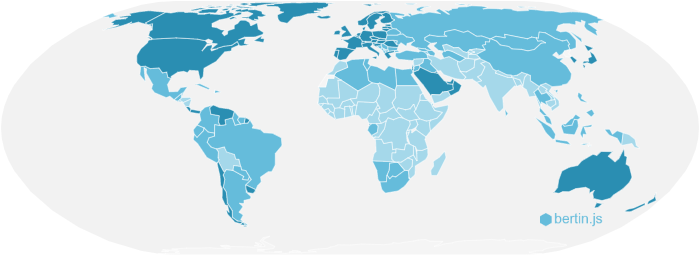

#### Code

```js
bertin.draw({
  layers: [
    {
      type: "layer",
      geojson: data,
      fill: {
        type: "choro",
        values: "gdppc",
        nbreaks: 5,
        method: "quantile",
        colors: "RdYlGn",
        leg_round: -1,
        leg_title: `GDP per inh (in $)`,
        leg_x: 100,
        leg_y: 200
      }
  ]
})
```

#### Parameters

- **values**: a string corresponding to the targeted variable in the properties (**compulsory**)
- **nbreaks**: Number of classes (default:5)
- **breaks**: Class breaks (default:null)
- **colors**: An array of colors or a palette of categorical colors (default: "Blues") [See](https://observablehq.com/@d3/color-schemes)
- **method**: A method of classification. Jenks, q6, quantiles, msd (mean standard deviation), equal (default: quantiles). See [statsbreaks](https://observablehq.com/@neocartocnrs/hello-statsbreaks) example for method implementation in action.
- **middle**: for msd method only. middle class or not (default:false);
- **k**: for msd method only. number of sd. (default:1);
- **col_missing**: Color for missing values (default "#f5f5f5")
- **txt_missing**: Text for missing values (default "No data")
- **stroke**: stroke color (default: "white")
- **strokeWidth**: Stroke width (default: 0.5)
- **fillOpacity**: Fill opacity (default: 1)

Parameters of the legend

- **leg_x**: position in x (if this value is not filled, the legend is not displayed)
- **leg_y**: position in y (if this value is not filled, the legend is not displayed)
- **leg_w**: width of the box (default: 30)
- **leg_h**: height of the box (default:20)
- **leg_text**: text of the box (default: "leg_text")
- **leg_fontSize**: text font size (default: 10)
- **leg_fill**: color of the box (same as the layer displayed)
- **leg_stroke**: stroke of the box (default: "black")
- **leg_strokeWidth**: stroke-width (default: 0.5)
- **leg_fillOpacity**: stroke opacity (same as the layer displayed)
- **leg_txtcol**: color of the text (default: "#363636")
- **leg_round**: Number of digits (default: undefined)

### Typology

The _typo_ type allows to realize a qualitative map. The choro type can be applied to the fill or stroke property of a simple layer. [Example](https://observablehq.com/@neocartocnrs/bertin-js-typo?collection=@neocartocnrs/bertin).


#### Code

```js
bertin.draw({
layers: [
  {
    type: "layer",
    geojson: data,
    fill: {
      type: "typo",
      values: "region",
      pal: "Tableau10",
      tooltip: ["$region", "$name"],
      leg_title: `The Continents`,
      leg_x: 55,
      leg_y: 180
    }
  ]
})
```

#### Parameters

- **values**: a string corresponding to the targeted variable in the properties (**compulsory**)
- **colors**: An array containing n colors for n types, or a a palette of categorical colors (default: "Tableau10"). See the handy [color scheme reference](https://observablehq.com/@d3/color-schemes) for full list of palettes.
- **order**: an array of values to set the order of the colors
- **col_missing**: Color for missing values (default "#f5f5f5")
- **txt_missing**: Text for missing values (default "No data")
- **stroke**: stroke color (default: "white")
- **strokeWidth**: Stroke width (default: 0.5)
- **fillOpacity**: Fill opacity (default: 1)

Parameters of the legend

- **leg_x**: position in x (if this value is not filled, the legend is not displayed)
- **leg_y**: position in y (if this value is not filled, the legend is not displayed)
- **leg_w**: width of the box (default: 30)
- **leg_h**: height of the box (default:20)
- **leg_title**: title of the legend (default; null)
- **leg_fontSize**: title legend font size (default: 14)
- **leg_fontSize2**: values font size (default: 10)
- **leg_stroke**: stroke of the box (default: "black")
- **leg_strokeWidth**: stroke-width (default: 0.5)
- **leg_fillOpacity**: stroke opacity (same as the layer displayed)
- **leg_txtcol**: color of the text (default: "#363636")

### Bubble

The _bubble_ type is used to draw a map by proportional circles. [Source](https://github.com/neocarto/bertin/blob/main/src/layers/bubble.js), [Example](https://observablehq.com/@neocartocnrs/bertin-js-prop-symbols?collection=@neocartocnrs/bertin).

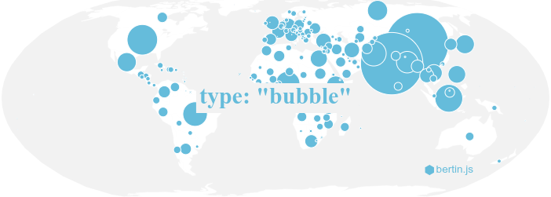

#### Code

```js
bertin.draw({
  layers: [
    {
      type: "bubble",
      geojson: countries,
      values: "pop",
      k: 60,
      tooltip: ["$country", "$pop", "(inh.)"],
    },
  ],
});
```

#### Parameters

- **geojson**: a geojson (**compulsory**)
- **values**: a string corresponding to the targeted variable in the properties(**compulsory**)
- **k**: size of the largest circle (default:50)
- **fixmax**: Max value to fix the size of the biggest circle, in order to make maps comparable (default:undefined)
- **fill**: fill color (default: random color)
- **stroke**: stroke color (default: "white")
- **strokeWidth**: stroke width (default: 0.5)
- **fillOpacity**: fill opacity (default: 1)
- **dorling**: a boolean (default:false)
- **iteration**: an integer to define the number of iteration for the Dorling method (default: 200)
- **tooltip**: an array of values defining what to display within the tooltip. If you use a $, the value within the geojson is displayed. [Example](https://observablehq.com/@neocartocnrs/bertin-js-tooltips?collection=@neocartocnrs/bertin).
- **display**: Boolean to allow to show or hide the layer. This parameter has no effect on the calculation of the extent. (default: true)

Parameters of the legend

- **leg_x**: position in x (if this value is not filled, the legend is not displayed)
- **leg_y**: position in y (if this value is not filled, the legend is not displayed)
- **leg_fill**: color of the circles (default: "none")
- **leg_stroke**: stroke of the circles (default: "black")
- **leg_strokeWidth**: stoke-width (default: 0.8)
- **leg_txtcol**: color of the text (default: "#363636")
- **leg_title**: title of the legend (default var_data)
- **leg_round**: number of digits after the decimal point (default: undefined)
- **leg_fontSize**: title legend font size (default: 14)
- **leg_fontSize2**: values font size (default: 10)


### Square

The _square_ type is used to draw a map by proportional squares. [Source](https://github.com/neocarto/bertin/blob/main/src/layers/square.js), [Example](https://observablehq.com/@neocartocnrs/bertin-js-prop-squares?collection=@neocartocnrs/bertin).

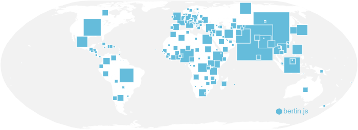

#### Code

```js
bertin.draw({
  layers: [
    {
      type: "square",
      geojson: countries,
      values: "pop",
      k: 60,
      tooltip: ["$country", "$pop", "(inh.)"],
    },
  ],
});
```

#### Parameters

- **geojson**: a geojson (**compulsory**)
- **values**: a string corresponding to the targeted variable in the properties(**compulsory**)
- **k**: size of the largest circle (default:50)
- **fixmax**: Max value to fix the size of the biggest circle, in order to make maps comparable (default:undefined)
- **fill**: fill color (default: random color)
- **stroke**: stroke color (default: "white")
- **strokeWidth**: stroke width (default: 0.5)
- **fillOpacity**: fill opacity (default: 1)
- **demers**: a boolean to avoid overlay. Dorling parameter works also (default:false)
- **iteration**: an integer to define the number of iteration for the Dorling method (default: 200)
- **tooltip**: an array of values defining what to display within the tooltip. If you use a $, the value within the geojson is displayed. [Example](https://observablehq.com/@neocartocnrs/bertin-js-tooltips?collection=@neocartocnrs/bertin).
- **display**: Boolean to allow to show or hide the layer. This parameter has no effect on the calculation of the extent. (default: true)

Parameters of the legend

- **leg_x**: position in x (if this value is not filled, the legend is not displayed)
- **leg_y**: position in y (if this value is not filled, the legend is not displayed)
- **leg_fill**: color of the circles (default: "none")
- **leg_stroke**: stroke of the circles (default: "black")
- **leg_strokeWidth**: stoke-width (default: 0.8)
- **leg_txtcol**: color of the text (default: "#363636")
- **leg_title**: title of the legend (default var_data)
- **leg_round**: number of digits after the decimal point (default: undefined)
- **leg_fontSize**: title legend font size (default: 14)
- **leg_fontSize2**: values font size (default: 10)

### Regular Bubble

The _regularbubble_ type is used to draw a map by proportional circles in a regular grid, from absolute quantitative data. [Source](https://github.com/neocarto/bertin/blob/main/src/layers/regularbubble.js), [Example and methodology](https://observablehq.com/@neocartocnrs/bertin-js-regular-bubbles?collection=@neocartocnrs/bertin).

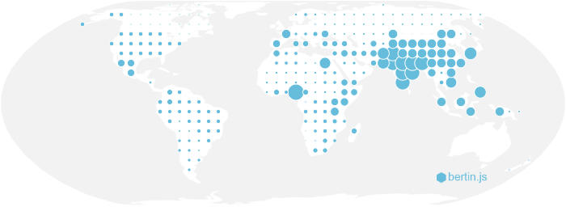

#### Code

```js
bertin.draw({
  layers: [
    {
      type: "regularbubble",
      geojson: countries,
      step:20,
      values: "pop",
      k: 60,
      tooltip: "$value",
    },
  ],
});
```

#### Parameters

- **step**: Gap between the points (default:20)

All other parameters are the same as for the bubble layer

### Regular Square

The _regularsquare_ type is used to draw a map by proportional squares in a regular grid, from absolute quantitative data. [Source](https://github.com/neocarto/bertin/blob/main/src/layers/regularsquare.js), [Example and methodology](https://observablehq.com/@neocartocnrs/bertin-js-regular-squares?collection=@neocartocnrs/bertin).

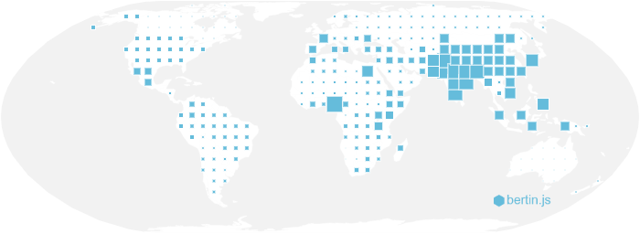

#### Code

```js
bertin.draw({
  layers: [
    {
      type: "regularsquare",
      geojson: countries,
      step:20,
      values: "pop",
      k: 60,
      tooltip: "$value",
    },
  ],
});
```

#### Parameters

- **step**: Gap between the points (default:20)

All other parameters are the same as for the square layer

### Regular grid

The _regulargrid_ type is a way to transform an irregular geographic mesh into a regular mesh. The values of the grid cells are obtained in proportion to the intersected surface. This representation mode is only suitable for absolute quantitative data. But you can use 2 quantitative data to compute a ratio [Source](https://github.com/neocarto/bertin/blob/main/src/layers/regulargrid.js), [Example and methodology](https://observablehq.com/@neocartocnrs/bertin-js-regular-grid).

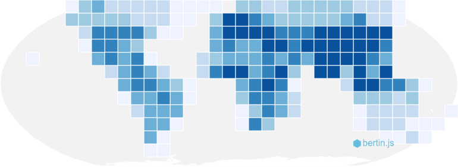

#### Code

```js
bertin.draw({
  layers: [
    {
      type: "regulargrid",
      geojson: countries,
      step:20,
      values: "pop",
      fill:{
        nbreaks: 6,
        method: "quantile",
        colors: "Blues"
      }
      tooltip: "$value",
    },
  ],
});
```

#### Parameters

- **step**: Gap between the points (default:20)
- **blur**: radius of the kernel defined in [d3.blur2](https://github.com/d3/d3-array/blob/main/README.md#blur) (default: 0)

All other parameters are the same as for [choropleth maps](https://github.com/neocarto/bertin#choropleth)

### Stock and ratio

In thematic mapping, we often have to represent an absolute quantitative data with a size variation and relative quantitative data with color variations. For this we can use the bubble type and the choro type together. [Example](https://observablehq.com/d/31a3309790d7bed9?collection=@neocartocnrs/bertin).


#### Code

```js
bertin.draw({
  params: { projection: d3.geoPolyhedralWaterman() },
  layers: [
    {
      type: "bubble",
      geojson: data,
      leg_round: -2,
      values: "pop",
      fill: {
        type: "choro",
        method: "quantile",
        nbreaks: 5,
        values: "gdppc",
        pal: "RdYlGn",
      },
    },
  ],
});
```

### Stock and typo

In thematic mapping, we often have to represent an absolute quantitative data with a size variation and relative quantitative data with color variations. For this we can use the bubble type and the typo type together. [Example](https://observablehq.com/d/8c9b22ccdffc718d?collection=@neocartocnrs/bertin).

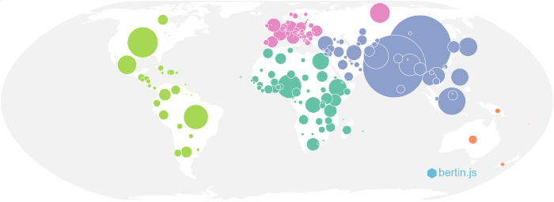

#### Code

```js
bertin.draw({
  layers: [
    {
      type: "bubble",
      geojson: data,
      values: "pop",
      fill: {
        type: "typo",
        values: "region",
      },
    },
  ],
});
```

### Dorling cartogram

The _dorling_ parameter can be used with the _bubble_ type to design a Dorling cartogram. [Example](https://observablehq.com/@neocartocnrs/bertin-js-dorling-cartogram?collection=@neocartocnrs/bertin).

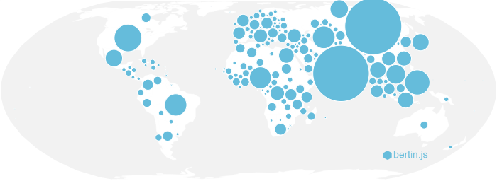

#### Code

```js
bertin.draw({
  layers: [
    {
      type: "bubble",
      geojson: data,
      values: "pop",
      k: k,
      dorling: true,
      iteration: 100,
      fill: "#E95B40",
    },
  ],
});
```

### Dot cartogram

The _dotcartogram_ type is a method of map representation that follows Dorling's cartograms and dot density maps. The data from each territorial unit are dissolved in such a way that a dot represents a constant quantity, the same on the whole map. [Source](https://github.com/neocarto/bertin/blob/main/src/layers/dotcartogram.js) [Example](https://observablehq.com/@neocartocnrs/bertin-js-dots-cartograms?collection=@neocartocnrs/bertin).

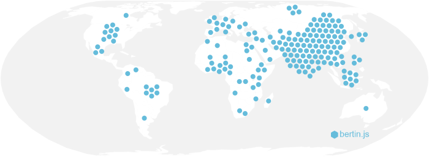

#### Code

```js
bertin.draw({
  params: { projection: d3.geoBertin1953() },
  layers: [
    {
      type: "dotcartogram",
      geojson: data,
      onedot: 200000000000,
      iteration: 200,
      values: "gdp",
      radius: radius,
      span: span,
      leg_fill: "none",
      leg_stroke: "black",
      leg_strokeWidth: 1.5,
      leg_x: 800,
      leg_y: 450,
      leg_title: `GDP by world region`,
      leg_txt: "200 billion $",
      fill: "red",
      tooltip: ["$name", "$region"],
    },
  ],
});
```

#### Parameters

- **geojson**: a geojson (**compulsory**)
- **values**: a string corresponding to the targeted variable in the properties(**compulsory**)
- **radius**: radius of dots (default:4)
- **nbmax**: number max of circles on the map (default:200)
- **onedot**: dot value (if onedot is filled, nbmax is useless)
- **span**: spacing between dots (default 0.5)
- **fill**: fill color (default: random color)
- **stroke**: stroke color (default: "white")
- **strokeWidth**: stroke width (default: 0.5)
- **fillOpacity**: fill opacity (default: 1)
- **tooltip** an array of values defining what to display within the tooltip. If you use a $, the value within the geojson is displayed.
- **iteration** an integer to define the number of iteration for the Dorling method (default 200)
- **display**: Boolean to allow to show or hide the layer. This parameter has no effect on the calculation of the extent. (default: true)

Parameters of the legend

- **leg_x**: position in x (if this value is not filled, the legend is not displayed)
- **leg_y**: position in y (if this value is not filled, the legend is not displayed)
- **leg_fill**: color of the circles (default: "none")
- **leg_stroke**: stroke of the circles (default: "black")
- **leg_strokeWidth**: stoke-width (default: 0.8)
- **leg_txtcol**: color of the text (default: "#363636")
- **leg_title**: title of the legend (default var_data)
- **leg_txt**: text in the legend (default onedot value)
- **leg_fontSize**: title legend font size (default: 14)
- **leg_fontSize2**: text font size (default: 10)

### Mushroom

The _mushroom_ type is used to draw a map with 2 superposed proportional semi-circles. This type of representation can be used when two data with the same order of magnitude need to be compressed. [Source](https://github.com/neocarto/bertin/blob/main/src/layers/mushroom.js), [Example](https://observablehq.com/d/3c51f698ba19546c?collection=@neocartocnrs/bertin).

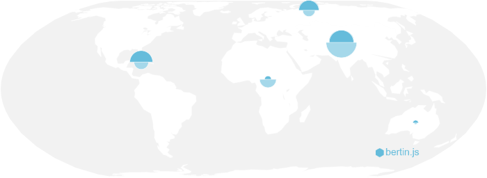

#### Code

```js
bertin.draw({
  layers: [
    {
      type: "mushroom",
      geojson: mygeojson,
      top_values: "gdp_pct",
      bottom_values: "pop_pct",
      bottom_tooltip: ["name", "pop", "(thousands inh.)"],
      top_tooltip: ["name", "gdp", "(million $)"],
    },
  ],
});
```

#### Parameters

- **geojson**: a geojson (**compulsory**)
- **top_values**: a string corresponding to the targeted top variable in the properties (**compulsory**)
- **bottom_values**: a string corresponding to the targeted bottom variable in the properties(**compulsory**)
- **top_fill**: top fill color (default: "#d64f4f")
- **bottom_fill**: bottom fill color (default: "#4fabd6")
- **k**: size of the largest semi circle (default:50)
- **stroke**: stroke color (default: "white")
- **strokeWidth**: stroke width (default: 0.5)
- **fillOpacity**: fill opacity (default: 1)
- **strokeOpacity**: stroke opacity (default: 1)
- **top_tooltip**: an array of values defining what to display within the tooltip. If you use a $, the value within the geojson is displayed.
- **bottom_tooltip**: an array of values defining what to display within the tooltip. If you use a $, the value within the geojson is displayed.
- **display**: Boolean to allow to show or hide the layer. This parameter has no effect on the calculation of the extent. (default: true)

Parameters of the legend

- **leg_x**: position in x (if this value is not filled, the legend is not displayed)
- **leg_y**: position in y (if this value is not filled, the legend is not displayed)
- **leg_fontSize**: title legend font size (default: 14)
- **leg_fontSize2**: values font size (default: 10)
- **leg_round**: number of digits after the decimal point (default: undefined)
- **leg_txtcol**: color of the text (default: "#363636")
- **leg_title**: title of the legend (default "Title, year")
- **leg_stroke**: stroke of the circles (default: "black")
- **leg_top_txt** title for the top variable (default top_var)
- **leg_bottom_txt** title for the bottom variable (default bottom_var)
- **leg_top_fill** color of top semi circles (default same as top_fill)
- **leg_bottom_fill** color of bottom semi circles (default same as bottom_fill)
- **leg_strokeWidth** stroke width of elements in the legend (default 0.8)

### Dot Density

The _dotdensity_ type allows to display a doty density layer geojson layer from polygons and attribute data. [Source](https://github.com/neocarto/bertin/blob/main/src/layers/dotdensity.js). [Example](https://observablehq.com/@neocartocnrs/bertin-js-dot-density-map-bertin?collection=@neocartocnrs/bertin)

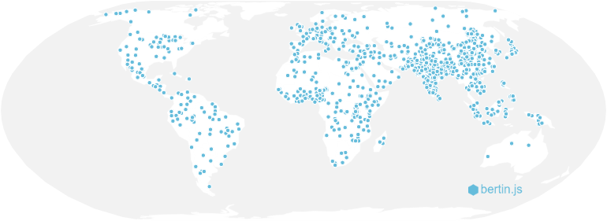

#### Code

```js
bertin.draw({
  layers: [
    {
      type: "dotdensity",
      geojson: *a geojson here (polygon)*,
      values: *a fiel here*
      dotvalue: *a number*,
    }
  ]
})
```

#### Parameters

- **geojson**: a geojson polygons or Multipolygons (**compulsory**)
- **values**: a string corresponding to the targeted variable in the properties(**compulsory**)
- **dotvalue**: a number representing the value of each point (default: a computed number so that there are no more than 1000 dots on the map.)
- **fill**: fill color (default: a random color)
- **stroke**: stroke color (default: "white")
- **strokeWidth** stroke width (default:0.5)
- **fillOpacity**: fill opacity (default:1)
- **strokeOpacity**: stroke opacity (default:1)
- **symbol**: if it is a dot layer, the type of symbol. "circle", "cross", "diamond", "square", "star", "triangle", "wye" (default: "circle")
- **symbol_size**: if it is a dot layer, a number indicating the size of the symbol (default: 5)
- **symbol_shift**: if it is a dot layer, use a value > 0 to switch symbols and avoid overlay (default: 0)
- **symbol_iteration**: Number of iteration to shift symbols (default: 200)
- **display**: Boolean to allow to show or hide the layer. This parameter has no effect on the calculation of the extent. (default: true)

Parameters of the legend

- **leg_x**: position in x (if this value is not filled, the legend is not displayed)
- **leg_y**: position in y (if this value is not filled, the legend is not displayed)
- **leg_w**: width of the box (default: 30)
- **leg_h**: height of the box (default:20)
- **leg_title**: title of the legend (default: null)
- **leg_text**: text in the legend (default: dot value)
- **leg_fontSize**: title legend font size (default: 14)
- **leg_fontSize2**: values font size (default: 10)
- **leg_fill**: color of the box (same as the layer displayed)
- **leg_stroke**: stroke of the box (default: "black")
- **leg_strokeWidth**: stroke-width (default: 0.5)
- **leg_fillOpacity**: stroke opacity (same as the layer displayed)
- **leg_txtcol**: color of the text (default: "#363636")

### Spikes

The _spikes_ type is used to draw a map with spikes. [Source](https://github.com/neocarto/bertin/blob/main/src/layers/spikes.js), [Example](https://observablehq.com/d/12446a15a2642907?collection=@neocartocnrs/bertin).

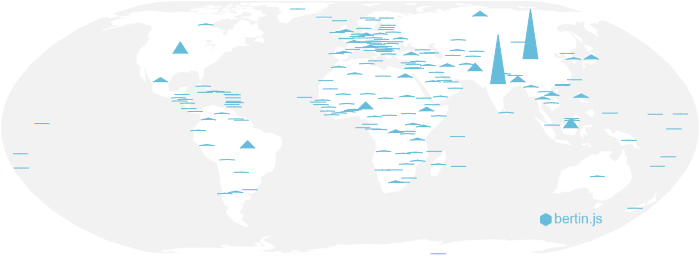

#### Code

```js
bertin.draw({
  layers: [
    {
      type: "spikes",
      geojson: countries,
      values: "pop",
      k: 60,
      w: 8,
      tooltip: ["$country", "$pop", "(inh.)"],
    },
  ],
});
```

#### Parameters

- **geojson**: a geojson (**compulsory**)
- **values**: a string corresponding to the targeted variable in the properties(**compulsory**)
- **k**: height of the highest peak (default:50)
- **w**: width of the spikes (default:10)
- **fill**: fill color (default: #a31d88)
- **stroke**: stroke color (default: #a31d88)
- **strokeWidth**: stroke width (default: 0.7)
- **fillOpacity**: fill opacity (default: 0.3)
- **tooltip** an array of values defining what to display within the tooltip. If you use a $, the value within the geojson is displayed.
- **display**: Boolean to allow to show or hide the layer. This parameter has no effect on the calculation of the extent. (default: true)

Parameters of the legend

- **leg_x**: position in x (if this value is not filled, the legend is not displayed)
- **leg_y**: position in y (if this value is not filled, the legend is not displayed)
- **leg_fill**: color of the circles (default: "none")
- **leg_stroke**: stroke of the circles (default: "black")
- **leg_strokeWidth**: stoke-width (default: 0.8)
- **leg_txtcol**: color of the text (default: "#363636")
- **leg_title**: title of the legend (default var_data)
- **leg_round**: rounding (default: undefined)
- **leg_fontSize**: title legend font size (default: 14)
- **leg_fontSize2**: values font size (default: 10)

### Smooth

The _smooth_ type (or heatmap or contour) is a way to produce a continuous représentations from quantitative data. The algorithm is complex. The values produced do not really make sense. Explanations with the parameters. [Source](https://github.com/neocarto/bertin/blob/main/src/layers/smooth.js), [Example and methodology](https://observablehq.com/@neocartocnrs/smooth).

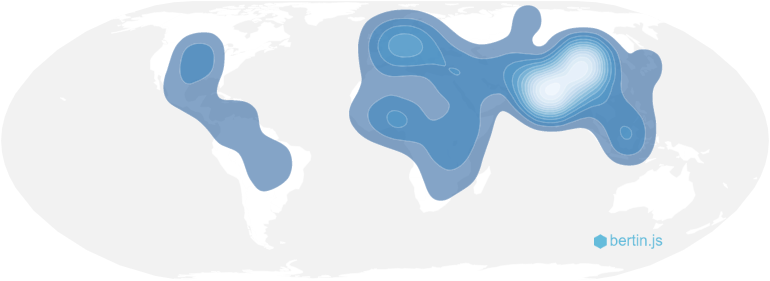

#### Code

```js
bertin.draw({
  layers: [
 {
      type: "smooth",
      geojson: data,
      values: "pop",
      thresholds: 50,
      bandwidth: 25,
      colorcurve: 1,
    },
  ],
});
```

#### Parameters

- **geojson**: a geojson (**compulsory**)
- **values**: a string corresponding to the targeted variable in the properties
- **stroke**: stroke color (default: "white")
- **strokeWidth** stroke width (default:0.5)
- **strokeLinecap**: stroke-linecap (default:"round")
- **strokeLinejoin**: stroke-linejoin (default:"round")
- **strokeDasharray**: stroke-dasharray (default:"none")
- **fillOpacity**: fill opacity (default:1)
- **strokeOpacity**: stroke opacity (default:1)
- **display**: Boolean to allow to show or hide the layer. This parameter has no effect on the calculation of the extent. (default: true)

Contour parameters

-**fill**: color palette. "Blues", "Greens", "Greys", "Oranges", "Purples", "Reds", "BrBG", "PRGn", "PiYG", "PuOr", "RdBu", "RdYlBu", "RdYlGn", "Spectral","Turbo","Viridis","Inferno", "Magma", "Plasma", "Cividis", "Warm", "Cool", "CubehelixDefault", "BuGn", "BuPu", "GnBu", "OrRd", "PuBuGn", "PuBu", "PuRd", "RdPu", "YlGnBu", "YlGn", "YlOrBr", "YlOrRd", "Rainbow", "Sinebow". (default: RdYlGn)
-**thresholds**: number of classes (default: 100)
-**bandwidth**: bandwidth (the standard deviation) of the Gaussian kernel and returns the estimate. (default: 5)
-**colorcurve**: a value to curve the color interpolation (default: 2)
-**reverse**: a boolean reverse the colors (default: false)
-**remove**: number of polygons to remove (default: 0)
-**clip**: a boolean to clip the contours with the input geojson (default: false)

By default, the smooth layer is calculated from dots or centroids. But it is possible to go through a regular grid by using theses parameters.  

- **grid_step**: Gap between the points (default:20)
- **grid_blur**: radius of the kernel defined in [d3.blur2](https://github.com/d3/d3-array/blob/main/README.md#blur) (default: 0)

### Thickness

On each layer, you can dynamically vary the thickness of the paths. This can be useful to make for example flow maps or discontinuity maps. [Source](https://github.com/neocarto/bertin/blob/main/src/helpers/thickness.js)

#### Code - Constant Thickness

In order for each object to have the same thickness.

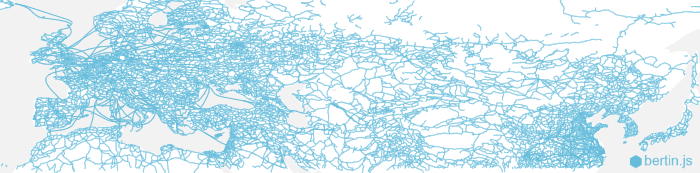


```js
bertin.draw({
  layers: [
    {
      type: "layer",
      geojson: *a geojson here*,
      strokeWidth: 3,
    }
  ]
})
```

#### Code - Linear variation

To vary the thickness proportionally to an quantitative data.

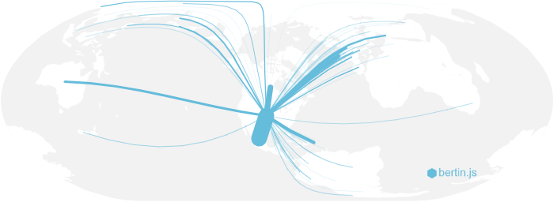

```js
bertin.draw({
  layers: [
    {
      type: "layer",
      geojson: *a geojson here*,
      strokeWidth: {type:"linear",values:"migration"},
    }
  ]
})
```

#### Parameters

- **values**: a string corresponding to the targeted variable in the properties(compulsory)
- **k**: thicken with the largest line (default:10)
- **fixmax**: Max value to fix the size of the thickest line, in order to make maps comparable (default:undefined)
- **fixmin**: Min value to fix the size of the thinest line. If true, the value is the min data. (default:0)

#### Code - Discrete variation

To vary the thickness according to classes values

```js
bertin.draw({
  layers: [
    {
      type: "layer",
      geojson: *a geojson here*,
      strokeWidth: {type:"discr",values:"migration", method: "q6"},
    }
  ]
})
```
#### Parameters

- **values**: a string corresponding to the targeted variable in the properties(compulsory)
- **k**: thicken with the largest line (default:10)
- **nbreaks**: Number of classes (default:5)
- **breaks**: Class breaks (default:null)
- **method**: A method of classification. Jenks, q6, quantiles, msd (mean standard deviation), equal (default: quantiles).
- **middle**: for msd method only. middle class or not (default:false).
- **sizes**: an array definig the sizes of each classes.
- **nbsd**: for msd method only. number of sd. (default:1)
- **sizes**: an array of thicknesses.

#### Code - Categories

To vary the thickness according to qualitative data.

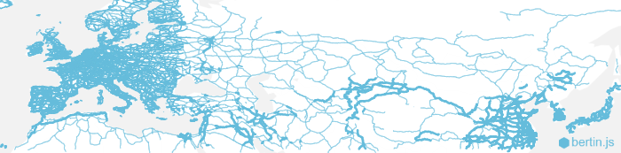

```js
bertin.draw({
  layers: [
    {
      type: "layer",
      geojson: *a geojson here*,
      strokeWidth: {type:"quali",values:"flow", categories: ["low", "medium", "high", "very high"]},
    }
  ]
})
```

#### Parameters

- **values**: a string corresponding to the targeted variable in the properties(compulsory)
- **k**: thicken with the largest line (default:10)
- **categories**: an array containing categories
- **sizes**: an array definig the sizes of each classes.
- **nbsd**: for msd method only. number of sd. (default:1)
- **sizes**: an array of thicknesses.

#### Parameters of the legends

- **leg_x**: position in x (if this value is not filled, the legend is not displayed)
- **leg_y**: position in y (if this value is not filled, the legend is not displayed)
- **leg_w**: width of the lines (default: 30)
- **leg_text**: text of the box (default: "leg_text")
- **leg_fontSize**: text font size (default: 10)
- **leg_fill**: color of the box (same as the layer displayed)
- **leg_stroke**: stroke of the box (default: "black")
- **leg_strokeWidth**: stroke-width (default: 0.5)
- **leg_fillOpacity**: stroke opacity (same as the layer displayed)
- **leg_txtcol**: color of the text (default: "#363636")
- **leg_round**: Number of digits (default: undefined)

## Map components

### Footer

The _footer_ type allows to display text under the map. This is useful to display sources. [Source](https://github.com/neocarto/bertin/blob/main/src/layers/footer.js).

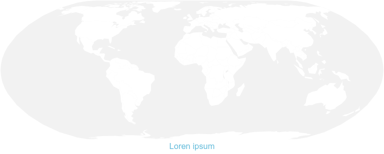

#### Code

```js
bertin.draw({
  layers: [
    {
      type: "footer",
      text: "Source: Worldbank, 2021",
      fontSize: 10,
    },
  ],
});
```

#### Parameters

- **text**: text to be displayed (default:"")
- **anchor**: text anchor. start, middle, end (default:"end")
- **fontSize**: size of the text (default:15)
- **fill**: color of the text (default:"#9e9696")
- **background**: background color (default: "white")
- **backgroundOpacity**: background opacity (default: 1)
- **display**: Boolean to allow to show or hide the layer. This parameter has no effect on the calculation of the extent. (default: true)

### Geolines

The _geolines_ type allows you to display geographic lines (equator, tropics, polar circles). [Source](https://github.com/neocarto/bertin/blob/main/src/layers/geolines.js).

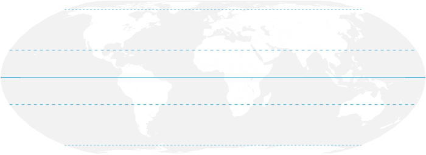

#### Code

```js
bertin.draw({
  layers: [
    {
      type: "geolines",
      stroke: "black",
      strokeWidth: [5, 3, 1],
    },
  ],
});
```

#### Parameters

*For each parameter, you can set a single value for all lines are an array in that order: [equator, tropics, polar].*

- **stroke**: stroke color (default: "#020e21")
- **strokeWidth**: stroke width (default: [1.5, 1.2, 0.7])
- **strokeOpacity**: stroke opacity (default: 1)
- **strokeDasharray**: stroke-dasharray (default: ["none", 5, 3])
- **strokeLinecap**: stroke-linecap (default: "but")
- **display**: Boolean to allow to show or hide the layer. This parameter has no effect on the calculation of the extent. (default: true)

### Graticule

The _graticule_ type allows you to display the latitude and longitude lines. [Source](https://github.com/neocarto/bertin/blob/main/src/layers/graticule.js).

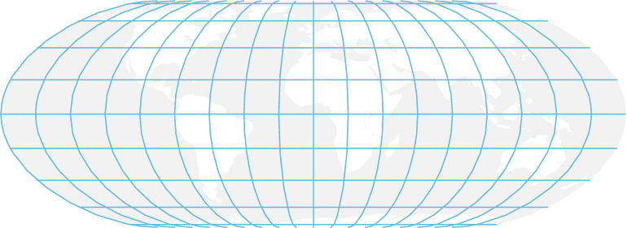

#### Code

```js
bertin.draw({
  layers: [
    {
      type: "graticule",
      fill: "#644580",
      step: [20, 10],
    },
  ],
});
```

#### Parameters

- **stroke**: stroke color (default:"white")
- **strokeWidth**: stroke width (default:0.8)
- **strokeOpacity**: stroke opacity (default:0.5)
- **strokeDasharray**: stroke-dasharray (default:2)
- **step**: gap between graticules. The value can be a number or an array of two values (default: [10, 10])
- **display**: Boolean to allow to show or hide the layer. This parameter has no effect on the calculation of the extent. (default: true)

### hatch (or hatching)

The _hatch_ type only allows to add hatchings on the whole page to make it a bit prettier. [Source](https://github.com/neocarto/bertin/blob/main/src/layers/hatch.js).

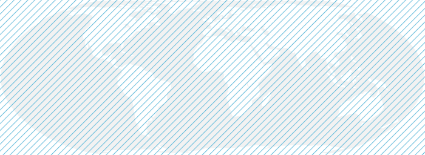

#### Code

```js
bertin.draw({
  layers: [
    {
      type: "hatch",
      angle: 45,
    },
  ],
});
```
#### Parameters

- **stroke**: stroke color (default: "#786d6c")
- **strokeWidth**: stroke color (default: 2)
- **strokeOpacity**: stroke-opacity (default: 45)
- **strokeDasharray**: stroke-dasharray (default:"none")
- **angle**: orientation of lines (default: 45)
- **spacing**: spacing between lines (default: 8)
- **display**: Boolean to allow to show or hide the layer. This parameter has no effect on the calculation of the extent. (default: true)

### Inner

The _inner_ type allows to display a strip inside the polygon. This inner area can be used to draw preet maps with a vintage style.

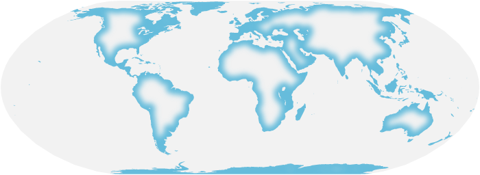

#### Code

```js
bertin.draw({
  layers: [
    {
      type: "inner",
      thickness: 5,
      fill:"white",
      blur:4
    },
  ],
});
```

#### Parameters

- **thickness**: a thickness in pixels (default: 7)
- **fill**: fill color (default: "#9e9477")
- **fillOpacity**: fill-opacity (default: 0.2)
- **blur**: blur. feGaussianBlur stdDeviation value (default:4)
- **display**: Boolean to allow to show or hide the layer. This parameter has no effect on the calculation of the extent. (default: true)

### Minimap (location map)

The _minimap_ type (or _location_) allows to display a location map showing the coverage of the map. [Source](https://github.com/neocarto/bertin/blob/main/src/layers/minimap.js). [Example](https://observablehq.com/@neocartocnrs/bertin-js-location-map)


```js
bertin.draw({
  layers: [
    {
      type: "minimap",
      x: 50,
      y: 50
      width:300,
      frame:{fill: "yellow", stroke: "none"}
    },
  ],
});
```
#### Parameters

- **x**: position in x (default: 5)
- **y**: position in y (default: 5)
- **width**: Width (default: 200)
- **projection**: minimap projection (default: "Equirectangular")
- **geojson**: geometries of the map (default: null)
- **extent**: minimap extent (default: null)
- **threshold**: area defining the threshold between dot and polygon representation (default: 0.1)
- **background**: an object to define the style of the background
(default: {stroke: "black", strokeWidth: 1, strokeOpacity: 1, fill: "white", fillOpacity: 1})
- **geometries**: an object to define the style of the basemap
(default: {fill: "#CCC", stroke: "none", strokeWidth: 1, fillOpacity: 1, strokeOpacity: 1})
- **raise**: an object to define the style of the highlight area
(default: {fill: "red", stroke: "none", strokeWidth: 1, fillOpacity: 1, strokeOpacity: 1})
- **frame**: an object to define the style of the frame
(default: {stroke: "none", strokeWidth: 1, strokeOpacity: 1, fill: "red", fillOpacity: 0.25})
- **dot**: an object to define the style of the dot
(default: {fill: "red", r: 5, stroke: "none", strokeWidth: 1, fillOpacity: 1,strokeOpacity: 1})

### Rhumbs

The rhumbs type allows to display "rhumb lines" like on old [portolan charts](https://en.wikipedia.org/wiki/Portolan_chart).  [Source](https://github.com/neocarto/bertin/blob/main/src/layers/rhumbs.js).

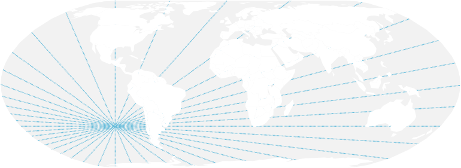

#### Code

```js
bertin.draw({
  layers: [
    {
      type: "rhumbs",
      position: [370, 370],
      nb: 25
    },
  ],
});
```

#### Parameters

- **nb**: number of lines (default: 10)
- **position**: position of the center in x and y (default: [height / 4, width - width / 4])
- **stroke**: stroke color (default: "#786d6c")
- **strokeWidth**: stroke color (default: 2)
- **strokeOpacity**: stroke-opacity (default: 45)
- **strokeDasharray**: stroke-dasharray (default:"none")
- **display**: Boolean to allow to show or hide the layer. This parameter has no effect on the calculation of the extent. (default: true)

#### Water lines (slow)

The _waterlines_ type only allows to display lines spaced by a defined distance. It's just a graphic trick to make the maps look nice.   [Source](https://github.com/neocarto/bertin/blob/main/src/layers/waterlines.js).

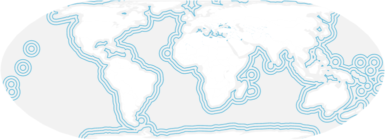

#### Code

```js
bertin.draw({
  layers: [
    {
      type: "waterlines",
      geojson: world,
      dist: 100,
      nb: 5
    },
  ],
});
```

#### Parameters

- **dist**: distance between lines in pixels (default: 5)
- **nb**: number of lines (default: 3)
- **precision**: number of steps defining buffers. 1 = not accurate, 8 = accurate. (default: 3)
- **stroke**: stroke. If more than 1 value is defined, a linear scale is done beetwen values (default:"#5d81ba")
- **strokeOpacity**: stroke-opacity. If more than 1 value is defined, a linear scale is done beetwen values (default: [1, 0.1])
- **strokeWidth**: stroke-width. If more than 1 value is defined, a linear scale is done beetwen values(default: [1.2, 0.2])
- **strokeDasharray**: stroke-dasharray (default: "none")
- **strokeLinecap**: stroke-linecap (default: "round")
- **strokeLinejoin**: stroke-linejoin (default: "round")
- **display**: Boolean to allow to show or hide the layer. This parameter has no effect on the calculation of the extent. (default: true)

#### logo

The logo type only allows allows to display a logo on the map from an url. By default, the bertin.js logo is displayed. [Source](https://github.com/neocarto/bertin/blob/main/src/layers/logo.js) [Example](https://observablehq.com/@neocartocnrs/bertin-logo).

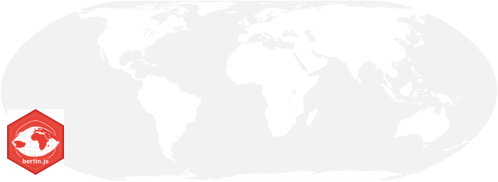

#### Code

```js
bertin.draw({
  layers: [
    {
      type: "logo",
      url: "http://myimage.png"
      position: "left",
    },
  ],
});
```

#### Parameters

- **url**: a string containing an url(default: bertin logo)
- **position**: an array of two cootdinates [x, y] or predefined positions as "left", "right" or "middle" (default: "left")
- **size**: width of the logo. (default: 100)
- **display**: Boolean to allow to show or hide the layer. This parameter has no effect on the calculation of the extent. (default: true)

### Header

The _header_ type allows to display a title above the map. [Source](https://github.com/neocarto/bertin/blob/main/src/layers/header.js).

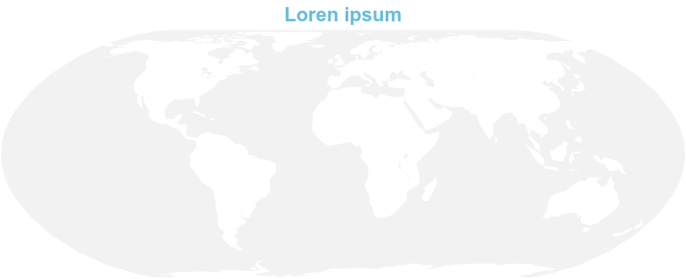

#### Code

```js
bertin.draw({
  layers: [
    {
      type: "header",
      text: "Title of the map",
      fontSize: 40,
    },
  ],
});
```

#### Parameters

- **text**: text to be displayed (default:"")
- **anchor**: text anchor. start, middle, end (default:"middle")
- **fontSize**: size of the text (default:20)
- **fill**: color of the text (default:"#9e9696")
- **background**: background color (default: "white")
- **backgroundOpacity**: background opacity (default: 1)
- **display**: Boolean to allow to show or hide the layer. This parameter has no effect on the calculation of the extent. (default: true)

### Labels

The _label_ type allows to display labels from a geojson. [Source](https://github.com/neocarto/bertin/blob/main/src/layers/label.js), [Example](https://observablehq.com/@neocartocnrs/bertin-js-texts).

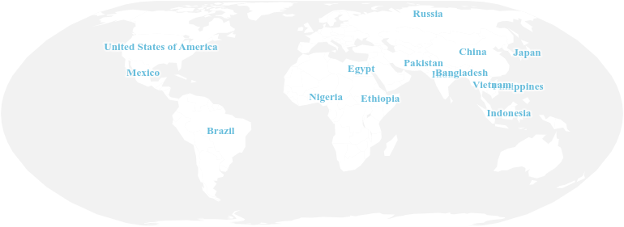

#### Code

```js
bertin.draw({
  layers: [
    {
      type: "label",
      geojson: countries,
      values: "name",
    },
  ],
});
```

#### Parameters

- **geojson**: a geojson (**compulsory**)
- **values**: a string corresponding to the targeted variable in the properties (**compulsory**)
- **fill**: fill color (default: "#474342")
- **fontSize**: font size (default: 10)
- **fontFamily**: font family. "Pacifico","Roboto","Rubik","Ubuntu" (default: "Roboto")
- **textDecoration**: text decoration. "none", "underline", "line-through", "overline" (default:"none")
- **fontWeight**: font weight. "normal", "bold", "bolder", "lighter" (default: "normal")
- **fontStyle**: font style. "normal", "italic", "oblique" (default: "normal")
- **opacity**: opacity (default: 1)
- **halo**: boolean to display a halo below the text (default: false)
- **halo_style**: an array defining the halo style. [color, thickness, opacity]  (default: ["white","4, 0.5)
- **display**: Boolean to allow to show or hide the layer. This parameter has no effect on the calculation of the extent. (default: true)

### Missing

The _missing_ type displays any missing data when creating a map by proportional symbols. The highlight of graphical elements (in white under the symbols) allows for clear data comprehension of gaps in data. [Source](https://github.com/neocarto/bertin/blob/main/src/layers/missing.js).

#### Code

```js
bertin.draw({
  layers: [
    {
      type: "missing",
      geojson: countries,
      values: "pop"
  ]
})
```

#### Parameters

- **geojson**: a geojson (**compulsory**)
- **values**: a string corresponding to the targeted variable in the properties (**compulsory**)
- **fill**: fill color (default: "white")
- **stroke**: stroke color (default: "white")
- **strokeWidth**: stroke width (default: 0.5)
- **fillOpacity**: fill opacity (default: 1)
- **display**: Boolean to allow to show or hide the layer. This parameter has no effect on the calculation of the extent. (default: true)

Parameters of the legend

- **leg_x**: position in x (if this value is not filled, the legend is not displayed)
- **leg_y**: position in y (if this value is not filled, the legend is not displayed)
- **leg_w**: width of the box (default: 30)
- **leg_h**: height of the box (default:20)
- **leg_text**: text of the box (default: "leg_text")
- **leg_fontSize**: text font size (default: 10)
- **leg_fill**: color of the box (same as the layer displayed)
- **leg_stroke**: stroke of the box (default: "black")
- **leg_strokeWidth**: stroke-width (default: 0.5)
- **leg_fillOpacity**: stroke opacity (same as the layer displayed)
- **leg_txtcol**: color of the text (default: "#363636")

### Outline

The _outline_ type is used to display the limits of the earth area in the given projection. [Source](https://github.com/neocarto/bertin/blob/main/src/layers/missing.js).

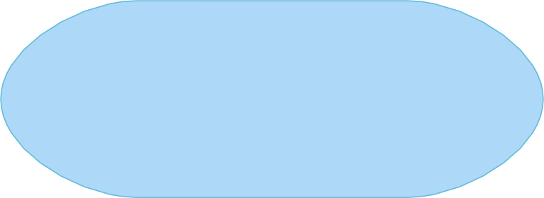

#### Code

```js
bertin.draw({
  layers: [
    {
      type: "outline",
      fill: "#4269ad",
    },
  ],
});
```

#### Parameters

- **fill**: fill color of the outline (default: "#add8f7")
- **opacity**: opacity (default:1)
- **stroke**: stroke color (default:"none")
- **strokeWidth**: stroke width (default: 1)
- **display**: Boolean to allow to show or hide the layer. This parameter has no effect on the calculation of the extent. (default: true)

### Scalebar

The _scalebar_ type allows to display a scale bar in miles or kilometers. [Source](https://github.com/neocarto/bertin/blob/main/src/layers/scalebar.js).

#### Code

```js
bertin.draw({
  layers: [
    {
      type: "scalebar",
      units: "miles",
    },
  ],
});
```

#### Parameters

- **x**: position in x (if this value is not filled, the legend is displayed on the left)
- **y**: position in x (if this value is not filled, the legend is displayed at the bottom)
- **units**: distance unit, miles or kilometers (default: "kilometers")
- **display**: Boolean to allow to show or hide the layer. This parameter has no effect on the calculation of the extent. (default: true)

### Shadow

The _shadow_ type allows to display a shadow under a layer to give it a relief effect. [Source](https://github.com/neocarto/bertin/blob/main/src/layers/shadow.js).

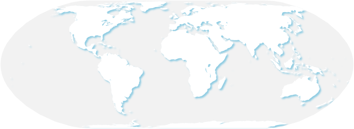

#### Code

```js
bertin.draw({
  layers: [
    {
      type: "shadow",
      geojson: JPN,
      dx: 5,
      dy: 5,
    },
  ],
});
```

#### Parameters

- **fill**: color (default: "#35383d")
- **dx**: shift in x (default: 3)
- **dy**: shift in y (default: 3)
- **stdDeviation**: blur (default: 1.5)
- **opacity**: opacity (default: 0.7)
- **display**: Boolean to allow to show or hide the layer. This parameter has no effect on the calculation of the extent. (default: true)

### Texts

The _text_ type simply allows you to display text anywhere on the map. [Source](https://github.com/neocarto/bertin/blob/main/src/layers/text.js). [Example](https://observablehq.com/d/95fcfac18b213daf?collection=@neocartocnrs/bertin).

#### Code

```js
bertin.draw({
  layers: [
    {
      type: "text",
      text: "This is my text",
      position: "bottomright",
      fontSize: 20,
      frame_stroke: "red",
      margin: 4,
    },
  ],
});
```

#### Parameters

- **position**: position of the text. It can be an array with x,y coordinates. For example [100,200]. It can be also a string defining the position. "topleft", "top", "topright", "left", "middle", "right", "bottomleft", "bottom", "bottomright" (default: "topleft")
- **text**: text to display. With the backticks, it is possible to display a text on several lines (default: "Your text here!")
- **fontSize**: text size (default: 15)
- **fontFamily**: font family. "Pacifico","Roboto","Rubik","Ubuntu" (default: "Roboto")
- **textDecoration**: text decoration. "none", "underline", "line-through", "overline" (default:"none")
- **fontWeight**: font weight. "normal", "bold", "bolder", "lighter" (default: "normal")
- **fontStyle**: font style. "normal", "italic", "oblique" (default: "normal")
- **margin**: margin around the text (default: 0)
- **anchor**: text anchor. start, middle, end (default: "start")
- **fill**: text color (default: "#474342")
- **stroke**: stroke color (default: "none")
- **frame_fill**: frame background color (default:"none")
- **frame_stroke**: frame stroke color (default: "none")
- **frame_strokeWidth**: thickness of the frame contour (default: 1)
- **frame_opacity**: frame opacity (default: 1)
- **display**: Boolean to allow to show or hide the layer. This parameter has no effect on the calculation of the extent. (default: true)

### Mercator Tiles

The _tiles_ type allow to display a raster basemap. [Source](https://github.com/neocarto/bertin/blob/main/src/layers/tile.js). [Example](https://observablehq.com/@neocartocnrs/bertin-js-tiles?collection=@neocartocnrs/bertin).

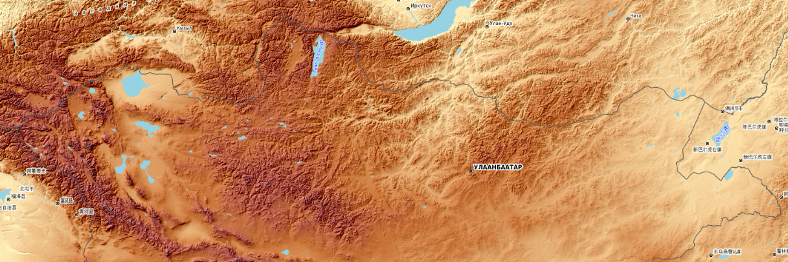

**NB: ** It works only with the d3.geoMercator() projection. if tiles layer is used is the *draw* function, the projection is automaticaly setted to d3.geoMercator(). And you can't change it.  

#### Code

```js
bertin.draw({
  params: { 
            projection: d3.geoMercator(),
            extent: *a geojson*  
          },
  layers: [
    {
      type: "tiles",
      style: "worldphysical"
    },
  ],
});
```

#### Parameters

- **style**: tile style: "openstreetmap", "opentopomap", "worldterrain", "worldimagery", "worldStreet", "worldphysical", "shadedrelief", "oceanbasemap". (default: "opentopomap"). You can alse use configurable like this:

```js
style: {
  provider: "OpenStreetMap contributors", 
  url: (x, y, z) => `https://tile.openstreetmap.org/${z}/${x}/${y}.png`,
   }
```
- **zoomDelta**: zoom offset. See explanations [here](https://github.com/d3/d3-tile#tile_zoomDelta) (default:0)
- **tileSize**: tile size. See explanations [here](https://github.com/d3/d3-tile#tile_tileSize) (default:512)
- **opacity**: tile opacity (default:1)
-**clip**: a geojson to clip the image
- **source**: position of the text. It can be an array with x,y coordinates. For example [100,200]. It can be also a string defining the position. "topleft", "top", "topright", "left", "middle", "right", "bottomleft", "bottom", "bottomright" (default: "topleft")
- **increasetilesize**: a value to slightly increase the size of the tiles solve the problem of gap between the tiles with chromium (deafault: 1)
- **display**: Boolean to allow to show or hide the layer. This parameter has no effect on the calculation of the extent. (default: true)

###  Tissot's indicatrix 

The _tissot_ type aims to draw Tissot circles to visualize the deformations due to the projection [Source](https://github.com/neocarto/bertin/blob/main/src/layers/tissot.js).

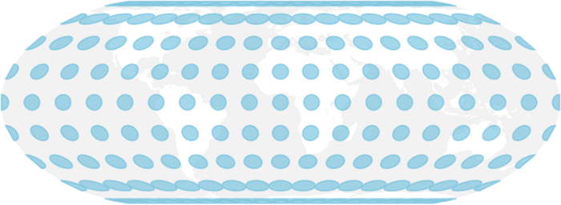

#### Code

```js
bertin.draw({
  layers: [
    {
      type: "tissot",
      step: 20
    },
  ],
});
```

#### Parameters

- **step**: step between circles
- **fill**: fill (default: "#d91848")
- **fillOpactity**: fill-opacity (default: 0.5)
- **stroke**: stroke (default: "#d91848")
- **strokeOpactity**: stroke-opacity (default: 0.6)
- **strokeWidth**: stroke-width (default: 1.5)
- **display**: Boolean to allow to show or hide the layer. This parameter has no effect on the calculation of the extent. (default: true)

## Custom Layer

The _custom_ type (or __function__ type) allows you to provide your own render function to create custom layer. [[Example](https://observablehq.com/@neocartocnrs/combine-d3-js-bertin-js-with-custom-layers)]

#### Code 

```js
bertin.draw({
  layers: [
    {
      type: "custom",
      render: function (svg, map) {
        svg
          .append("g")
          .append("rect")
          .attr("x", map.width / 2)
          .attr("y", map.height / 2)
          .attr("height", 100)
          .attr("width", 200)
          .style("fill", "red");
      }
    },
    { geojson: world, fill: "white" },
    { type: "graticule" },
    { type: "outline" }
  ]
})
```

Or with an external function

```js
function drawRectangle(svg, map, options) {
  const { fill, stroke, strokeWidth } = options; // Will have all options (parameters) set in the curret layer object, right?
  svg
    .append("g")
    .append("rect")
    .attr("x", map.width / 2)
    .attr("y", map.height / 2)
    .attr("height", 100)
    .attr("width", 200)
    .style("fill", fill)
    .style("stroke", stroke)
    .style("stroke-width", strokeWidth);
}
```

then:

```js
bertin.draw({
  params: { extent: world, width: 1000 },
  layers: [
    {
      type: "function",
      render: drawRectangle,
      fill: "red",
      stroke: "blue",
      strokeWidth: 10
    },
    { geojson: world, fill: "white" },
    { type: "graticule" },
    { type: "outline" }
  ]
})
```

with

`map.width`: the width of the map 
`map.height`: the height of the map  
`map.projection`: the projection of the map
`map.clipid`: the unique id of the map

## Geojson properties selections

### properties.add

*properties.add* allows to add a new field in the att ribute table. This function return a new object and do not modify the initial object. [Example](https://observablehq.com/@neocartocnrs/bertins-js-deal-with-with-geojson-properties?collection=@neocartocnrs/bertin). [Code](https://github.com/neocarto/bertin/blob/main/src/properties.js).

#### Code


```js
bertin.properties.add({
    geojson: world, 
    field: "gdppc", 
    expression: "gdp/pop*1000" 
})
```

#### Parameters

- **geojson**: a geojson
- **field**: new colname (string)
- **expression**:  a string containing an expression

### properties.filter

*properties.filter* allows to filter a geojson from its attribute table.This function return a new object and do not modify the initial object. [Example](https://observablehq.com/@neocartocnrs/bertins-js-deal-with-with-geojson-properties?collection=@neocartocnrs/bertin). [Code](https://github.com/neocarto/bertin/blob/main/src/properties.js).


#### Code

```js
bertin.properties.filter({
    x: world,
    expression: "pop2022 >= 100000" 
})
```

#### Parameters

- **geojson**: a geojson
- **expression**:  a string containing an expression

### properties.head

*properties.head* allows to get the n top values from a given field.This function return a new object and do not modify the initial object. [Example](https://observablehq.com/@neocartocnrs/bertins-js-deal-with-with-geojson-properties?collection=@neocartocnrs/bertin). [Code](https://github.com/neocarto/bertin/blob/main/src/properties.js).

#### Code

```js
bertin.properties.head({
    geojson: world,
    field: "gdp",
    nb: 5
})
```

#### Parameters

- **geojson**: a geojson
- **field**:  a string containing an colname
- **nb**: number of features to get (default:10)

### properties.keep

*properties.keep* allows to select one or several columns to keep in the attribute table. All other columns are deleted. This function return a new object and do not modify the initial object. [Example](https://observablehq.com/@neocartocnrs/bertins-js-deal-with-with-geojson-properties?collection=@neocartocnrs/bertin). [Code](https://github.com/neocarto/bertin/blob/main/src/properties.js).


#### Code

```js
bertin.properties.keep({
    geojson: world,
    field: ["ISO3", "pop2020"] 
})
```

#### Parameters

- **geojson**: a geojson
- **field**:  fields to keep (string or array of strings) 

### properties.remove

*properties.remove* allows to remove one or several columns in the attribute table. This function return a new object and do not modify the initial object. [Example](https://observablehq.com/@neocartocnrs/bertins-js-deal-with-with-geojson-properties?collection=@neocartocnrs/bertin). [Code](https://github.com/neocarto/bertin/blob/main/src/properties.js).

#### Code

```js
bertin.properties.remove({
    geojson: world,
    field: ["tmp", "FID"] 
})
```

#### Parameters

- **geojson**: a geojson
- **field**:  fields to remove (string or array of strings) 


### properties.subset

*properties.subset* allows to remove one or several columns in the attribute table. This function return a new object and do not modify the initial object. [Example](https://observablehq.com/@neocartocnrs/bertins-js-deal-with-with-geojson-properties?collection=@neocartocnrs/bertin). [Code](https://github.com/neocarto/bertin/blob/main/src/properties.js).

#### Code

```js
bertin.properties.subset({
    geojson: world,
    field: "ISO3",
    selection:   ["USA", "CAN", "MEX"],
    inverse: false
})
```

#### Parameters

- **geojson**: a geojson
- **field**:  fields to remove (string or array of strings) 
- **selection**: values to be kept. In the example above, North american countries
- **inverse**:  default: false. If true, all countries except USA, CAN and MEX are kept 

### properties.table

*properties.subset* allows to get a geojson attribute table [Example](https://observablehq.com/@neocartocnrs/bertins-js-deal-with-with-geojson-properties?collection=@neocartocnrs/bertin). [Code](https://github.com/neocarto/bertin/blob/main/src/properties.js).

#### Code

```js
bertin.properties.table(*a geojson*)
```

### properties.head

*properties.tail* allows to get the n bottom values from a given field. This function return a new object and do not modify the initial object. [Example](https://observablehq.com/@neocartocnrs/bertins-js-deal-with-with-geojson-properties?collection=@neocartocnrs/bertin). [Code](https://github.com/neocarto/bertin/blob/main/src/properties.js).


#### Code

```js
bertin.properties.tail({
    geojson: world,
    field: "gdp",
    nb: 5
})
```

#### Parameters

- **geojson**: a geojson
- **field**:  a string containing an colname
- **nb**: number of features to get (default:10)

## Other functions

### borders

_borders_ is a function that extract borders from polygons, with ids. [Source](https://github.com/neocarto/bertin/blob/main/src/borders.js)

#### Code

```js
bertin.borders({geojson: world, id: "iso3", values: "population", type = "rel"})
```

#### Parameters

- **geojson**: a geojson
- **id**: id codes
- **values**: values
- **type**: type of discontinuities calculated: rel(relative), abs(absolute) (default:"rel")

### bbox

_bbox_ computes a geojson object form an array defining an extent in latitude and longitude.

#### Code

```js
bertin.bbox([
  [112, -43],
  [153, -9],
]);
```

### Quickdraw

_quickdraw_ function displays one or more layers directly and easily. [Source](https://github.com/neocarto/bertin/blob/main/src/quickdraw.js), [Example](https://observablehq.com/d/8d5d24e4d175a0bf?collection=@neocartocnrs/bertin).

#### Code

```js
bertin.quickdraw(geojson);
```

```js
bertin.quickdraw(geojson, 1000, 7);
```

#### Parameters

- param 1 : a geojson (**compulsory**)
- param 2 : width
- param 3 : margin

### Match

_match()_ is a function to evaluate the quality of a join between the data and the background map. It returns a chart. [Source](https://github.com/neocarto/bertin/blob/main/src/match.js), [Example](https://observablehq.com/d/608ed06a679bfeca?collection=@neocartocnrs/bertin).

#### Code

```js
let testjoin = bertin.match(countries, "ISO3_CODE", maddison, "countrycode");
```

_.matched_ returns an array containing matched ids

```js
testjoin.matched;
```

_.matched_data_ returns an array containing matched data ids

```js
testjoin.matched_data;
```

_.unmatched_data_ returns an array containing unmatched data ids

```js
testjoin.unmatched_data;
```

_.unmatched_geom_ returns an array containing unmatched geom ids

```js
testjoin.unmatched_geom;
```

#### Parameters

- param 1 : a geojson (**compulsory**)
- param 2 : a string corresponding to the identifier of the features in the properties (**compulsory**)
- param 3 : a json (**compulsory**)
- param 4 : a string corresponding to the identifier of the features (**compulsory**)

### Merge

_merge_ is a function to join a geojson and a data file. This is the first step in the mapping process. [Source](https://github.com/neocarto/bertin/blob/main/src/merge.js), [Example](https://observablehq.com/d/608ed06a679bfeca?collection=@neocartocnrs/bertin).

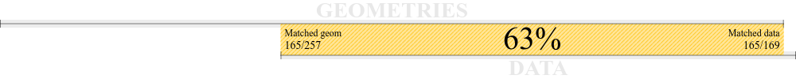

#### Code

```js
const data = bertin.merge(
  countries,
  "ISO3_CODE",
  maddison,
  "countrycode",
  true
);
```

#### Parameters

- param 1 : a geojson (**compulsory**)
- param 2 : a string corresponding to the identifier of the features in the properties (**compulsory**)
- param 3 : a json (**compulsory**)
- param 4 : a string corresponding to the identifier of the features (**compulsory**)
- param 5 : a boolean. If true, all geometries will be kept. If false, only matched data are kept (default: true)

### links

_links_ is a function that create links from geometries (polygons or points) and a data file (i,j,fij). [Source](https://github.com/neocarto/bertin/blob/main/src/links.js) [Example](https://observablehq.com/@neocartocnrs/bertin-js-links).

#### Code

```js
bertin.links({
  geojson: world,
  geojson_id: "ISO3",
  data: migr2019,
  data_i: "i",
  data_j: "j",
});
```

#### Parameters

- **geojson**: a geojson
- **geojson_id**: id of the geojson
- **data**: inj,fij data
- **data_i**: i id
- **data_j**: j id
- **planar**: a boolean. Set true if coordinates are already projected (default: false)

### subgeo

Depreciated. See *properties.subset*/

### table2geo

_table2geo_ function converts a data table with lat/lon fields to a geojson. [Source](https://github.com/neocarto/bertin/blob/main/src/table2geo.js), [Example](https://observablehq.com/d/8d5d24e4d175a0bf?collection=@neocartocnrs/bertin).

#### Code

```js
bertin.table2geo(cities, "lat", "lng");
```

#### Parameters

- param 1 : a geojson (**compulsory**)
- param 2 : latitude
- param 3 : longitude
