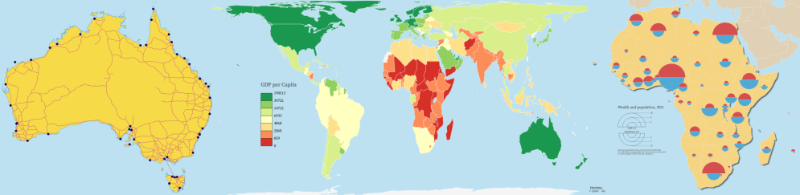

# bertin.js

_Bertin.js is <ins>**under development**</ins> so not necessarily very stable yet. The names of the functions and the parameters are still subject to change. Bugs will be corrected as they occur. New features will be added in the next versions._



bertin.js is an easy to use js library bsed on [d3js](https://github.com/d3/d3) to facilitate the process of making thematic maps. The principle is to work with layers stacked on each other. As in a GIS, the layers that are displayed above are placed at the top in the code, the layers that are displayed below are placed at the bottom in the code. The layers that can be displayed are of several types: header, footer, graticule, outline, choro, typo, prop, shadow, scalebar, text... Each type has its own parameters. This list will be completed gradually.

### Why Bertin ?

Jacques Bertin (1918-2010) was a French cartographer, whose major contribution was a theoretical and practical reflection on all graphic representations (diagrams, maps and graphs), forming the subject of a fundamental treatise, Graphic Semiology, originally published in 1967. Bertin's influence remains strong in the university teaching of cartography today, but also in the circles of statisticians and data visualization specialists.

## 1. Installation

#### <ins>In browser</ins>

Latest version

```html
<script src="https://cdn.jsdelivr.net/npm/bertin" charset="utf-8"></script>
```

Pinned version

```html
<script
  src="https://cdn.jsdelivr.net/npm/bertin@0.9.0"
  charset="utf-8"
></script>
```

#### <ins>In Observable</ins>

Latest version

```js
bertin = require("bertin");
```

Pinned version

```js
bertin = require("bertin@0.9.0");
```

## 2. How to use?

#### <ins>In browser</ins>

```js
<script src="https://cdn.jsdelivr.net/npm/d3@7"></script>
<script src="https://cdn.jsdelivr.net/npm/d3-geo-projection@4"></script>
<script src="https://cdn.jsdelivr.net/npm/bertin"></script>

<script>

let geojson = "https://raw.githubusercontent.com/neocarto/bertin/main/data/world.geojson"

d3.json(geojson).then(r =>
document.body.appendChild(bertin.draw({
  params: {
    projection: d3.geoVanDerGrinten4(),
    clip:true
  },
  layers: [
      {geojson: r,  tooltip: ["$ISO3", "$NAMEen"] },
      {type:"outline"},
      {type:"graticule"}
    ]
})));

</script>
```

See examples [here](https://neocarto.github.io/bertin/examples/example1.html) and [there](https://neocarto.github.io/bertin/examples/example2.html) and [there](https://neocarto.github.io/bertin/examples/example3.html).

#### <ins>In Observable</ins>

The bertin.js library is really easy to use within Observable. You'll find many examples in [this collection](https://observablehq.com/collection/@neocartocnrs/bertin).

## 3. bertin.draw

<b>draw</b>() is the main function of the library. It allows you to make various thematic maps. It allows to display and overlay different types of layers listed below. The layers written on top are displayed first. [Example](https://observablehq.com/@neocartocnrs/hello-bertin-js)

#### <ins>Global parameters</ins>

In the section _params_, we define the global parameters of the map: its size, projection, background color, etc. To have access to a large number of projections, you will need to load the [d3-geo-projection@4](https://github.com/d3/d3-geo-projection) library. This section is optional.

<details><summary>Code</summary>

```js
bertin.draw({
  params: {
    projection: d3.geoBertin1953(),
    width: 750,
  },
  layers: [...]
})
```

</details>

<details><summary>Parameters</summary>

- <b>projection</b>: a d3 function or proj4string defining the map projection. Cf [d3-geo-projection@4](https://github.com/d3/d3-geo-projection) & [https://spatialreference.org](https://spatialreference.org/) (default: d3.geoEquirectangular())
- <b>width</b>: width of the map (default:1000);
- <b>extent</b>: a feature or a bbox array defining the extent e.g. a country or [[112, -43],[153, -9]] (default: null)
- <b>margin</b>: margin around features to be displayed. This option can be useful if the stroke is very heavy (default: 1)
- <b>background</b>: color of the background (default: "none")
- <b>clip</b>: a boolen to avoid artefacts of discontinuous projection (default: "false")

</details>

## 4. Map types

#### Simple layer

The _layer_ type allows to display a simple geojson layer (points, lines or polygons). [Source](https://github.com/neocarto/bertin/blob/main/src/layer-simple.js). [Example 1](https://observablehq.com/@neocartocnrs/hello-bertin-js). [Example 2](https://observablehq.com/@neocartocnrs/bertin-js-symbols?collection=@neocartocnrs/bertin)

<details><summary>Code</summary>

```js
bertin.draw({
  layers: [
    {
      type: "layer",
      geojson: *a geojson here*,
      fill: "#e6acdf",
    }
  ]
})
```

</details>

<details><summary>Parameters</summary>

- <b>geojson</b>: a geojson (<ins>compulsory<ins>)
- <b>fill</b>: fill color (default: a random color)
- <b>stroke</b>: stroke color (default: "white")
- <b>strokeWidth</b> stroke width (default:0.5)
- <b>strokeLinecap</b>: stroke-linecap (dafault:"round")
- <b>strokeLinejoin<b/>: stroke-linejoin (default:"round")
- <b>strokeDasharray</b>: stroke-dasharray (default:"none")
- <b>fillOpacity</b>: fill opacity (default:1)
- <b>fillOpacity</b>: fill opacity (default:1)
- <b>symbol</b>: if it is a dot layer, the type of symbol. "circle", "cross", "diamond", "square", "star", "triangle", "wye" (default: "circle")
- <b>symbol_size</b>: if it is a dot layer, a number indicating the size of the symbol (default: 5)
- <b>symbol_shift</b>: if it is a dot layer, use a value > 0 to switch symbols and avoid overlay (default: 0)
- <b>symbol_iteration</b>: Number of iteration tu shift symbols (default: 200)

Parameters of the legend

- <b>leg_x</b>: position in x (if this value is not filled, the legend is not displayed)
- <b>leg_y</b>: position in y (if this value is not filled, the legend is not displayed)
- <b>leg_w</b>: width of the bof (default: 30)
- <b>leg_h</b>: height of the bof (default:20)
- <b>leg_title</b>: title of the legend (default; null)
- <b>leg_text</b>: text of the box (default: "text of the box")
- <b>leg_fontSize</b>: title legend font size (default: 14)
- <b>leg_fontSize2</b>: values font size (default: 10)
- <b>leg_fill</b>: color of the box (same as the layer displayed)
- <b>leg_stroke</b>: stroke of the box (default: "black")
- <b>leg_strokeWidth</b>: stroke-width (default: 0.5)
- <b>leg_fillOpacity</b>: stroke opacity (same as the layer displayed)
- <b>leg_txtcol</b>: color of the text (default: "#363636")

</details>

#### Choropleth

The _choro_ type aims to draw Choropleth maps. This kind of representation is especially suitable for relative quantitative data (rates, indices, densities). The choro type can be applied to the fill or stroke property of a simple layer. [Example](https://observablehq.com/@neocartocnrs/bertin-js-chropoleth?collection=@neocartocnrs/bertin)

<details><summary>Code</summary>

```js
bertin.draw({
  layers: [
    {
      type: "layer",
      geojson: data,
      fill: {
        type: "choro",
        values: "gdppc",
        nbreaks: 5,
        method: "quantile",
        pal: "RdYlGn",
        leg_round: -1,
        leg_title: `GDP per inh (in $)`,
        leg_x: 100,
        leg_y: 200
      }
  ]
})
```

</details>

<details><summary>Parameters</summary>

- <b>values</b>: a string corresponding to the targeted variable in the properties(<ins>compulsory<ins>)
- <b>pal</b>: a palette of categorical colors (default: "Blues") [See](https://observablehq.com/@d3/color-schemes)
- <b>nbreaks</b>: Number of classes (default:5)
- <b>breaks</b>: Class breaks (default:null)
- <b>colors</b>: An array of colors (default: null)
- <b>method</b>: A method of classification. Jenks, q6, quantiles, msd (mean standard deviation), equal (default: quantiles). See [statsbreaks](https://observablehq.com/@neocartocnrs/hello-statsbreaks)
- <b>middle</b>: for msd method only. middle class or not  (default:false);
- <b>k</b>: for  msd method only. number of sd. (default:1);
- <b>col_missing</b>: Color for missing values (default "#f5f5f5")
- <b>stroke</b>: stroke color (default: "white")
- <b>strokeWidth</b>: Stroke width (default: 0.5)
- <b>fillOpacity</b>: Fill opacity (default: 1)

Parameters of the legend

- <b>leg_x</b>: position in x (if this value is not filled, the legend is not displayed)
- <b>leg_y</b>: position in y (if this value is not filled, the legend is not displayed)
- <b>leg_w</b>: width of the bof (default: 30)
- <b>leg_h</b>: height of the bof (default:20)
- <b>leg_text</b>: text of the box (default: "text of the box")
- <b>leg_fontSize</b>: text font size (default: 10)
- <b>leg_fill</b>: color of the box (same as the layer displayed)
- <b>leg_stroke</b>: stroke of the box (default: "black")
- <b>leg_strokeWidth</b>: stroke-width (default: 0.5)
- <b>leg_fillOpacity</b>: stroke opacity (same as the layer displayed)
- <b>leg_txtcol</b>: color of the text (default: "#363636")
- <b>leg_round</b>: Number of digits (default: undefined)
</details>

#### Typology

The _typo_ type allows to realize a qualitative map. The choro type can be applied to the fill or stroke property of a simple layer. [Example](https://observablehq.com/@neocartocnrs/bertin-js-typo?collection=@neocartocnrs/bertin)

<details><summary>Code</summary>

```js
bertin.draw({
layers: [
  {
    type: "layer",
    geojson: data,
    fill: {
      type: "typo",
      values: "region",
      pal: "Tableau10",
      tooltip: ["region", "name", ""],
      leg_title: `The Continents`,
      leg_x: 55,
      leg_y: 180
    }
  ]
})
```

</details>

<details><summary>Parameters</summary>

- <b>values</b>: a string corresponding to the targeted variable in the properties (<ins>compulsory<ins>)
- <b>colors</b>: An array containing n colors for n types (default: null)
- <b>pal</b>: a palette of categorical colors (default: "Tableau10") [See](https://observablehq.com/@d3/color-schemes)
- <b>col_missing</b>: Color for missing values (default "#f5f5f5")
- <b>stroke</b>: stroke color (default: "white")
- <b>strokeWidth</b>: Stroke width (default: 0.5)
- <b>fillOpacity</b>: Fill opacity (default: 1)

Parameters of the legend

- <b>leg_x</b>: position in x (if this value is not filled, the legend is not displayed)
- <b>leg_y</b>: position in y (if this value is not filled, the legend is not displayed)
- <b>leg_w</b>: width of the bof (default: 30)
- <b>leg_h</b>: height of the bof (default:20)
- <b>leg_title</b>: title of the legend (default; null)
- <b>leg_fontSize</b>: title legend font size (default: 14)
- <b>leg_fontSize2</b>: values font size (default: 10)
- <b>leg_stroke</b>: stroke of the box (default: "black")
- <b>leg_strokeWidth</b>: stroke-width (default: 0.5)
- <b>leg_fillOpacity</b>: stroke opacity (same as the layer displayed)
- <b>leg_txtcol</b>: color of the text (default: "#363636")

</details>

#### Bubble

The _bubble_ type is used to draw a map by proportional circles. [Source](https://github.com/neocarto/bertin/blob/main/src/layer-bubble.js) [Example](https://observablehq.com/@neocartocnrs/bertin-js-prop-symbols?collection=@neocartocnrs/bertin)

<details><summary>Code</summary>

```js
bertin.draw({
  layers: [
    {
      type: "bubble",
      geojson: countries,
      values: "pop",
      k: 60,
      tooltip: ["country", "pop", "(inh.)"],
    },
  ],
});
```

</details>

<details><summary>Parameters</summary>

- <b>geojson</b>: a geojson (<ins>compulsory<ins>)
- <b>values</b>: a string corresponding to the targeted variable in the properties(<ins>compulsory<ins>)
- <b>k</b>: size of the largest circle (default:50)
- <b>fixmax</b>: Max value to fix the size of the biggest circle, in order to make maps comparable (default:undefined)
- <b>fill</b>: fill color (default: random color)
- <b>stroke</b>: stroke color (default: "white")
- <b>strokeWidth</b>: stroke width (default: 0.5)
- <b>fillOpacity</b>: fill opacity (default: 1)
- <b>dorling</b>: a boolean (default:false)
- <b>iteration</b> an integer to define the number of iteration for the Dorling method (default 200)
- <b>tooltip</b> an array of 3 values defining what to display within the tooltip. The two first values indicates the name of a field in the properties. the third value is a string to indicates the unit (default:"")

Parameters of the legend

- <b>leg_x</b>: position in x (if this value is not filled, the legend is not displayed)
- <b>leg_y</b>: position in y (if this value is not filled, the legend is not displayed)
- <b>leg_fill</b>: color of the circles (default: "none")
- <b>leg_stroke</b>: stroke of the circles (default: "black")
- <b>leg_strokeWidth</b>: stoke-width (default: 0.8)
- <b>leg_txtcol</b>: color of the text (default: "#363636")
- <b>leg_title</b>: title of the legend (default var_data)
- <b>leg_round</b>: number of digits after the decimal point (default: undefined)
- <b>leg_fontSize</b>: title legend font size (default: 14)
- <b>leg_fontSize2</b>: values font size (default: 10)

</details>

#### Stock + ratio

In thematic mapping, we often have to represent an absolute quantitative data with a size variation and relative quantitative data with color variations. For this we can use the bubble type + the choro type. [Example](https://observablehq.com/d/31a3309790d7bed9?collection=@neocartocnrs/bertin)

<details><summary>Code</summary>

```js
bertin.draw({
  params: { projection: d3.geoPolyhedralWaterman() },
  layers: [
    {
      type: "bubble",
      geojson: data,
      leg_round: -2,
      values: "pop",
      fill: {
        type: "choro",
        method: "quantile",
        nbreaks: 5,
        values: "gdppc",
        pal: "RdYlGn",
      },
    },
  ],
});
```

</details>

#### Stock + typo

In thematic mapping, we often have to represent an absolute quantitative data with a size variation and relative quantitative data with color variations. For this we can use the bubble type + the typo type. [Example](https://observablehq.com/d/8c9b22ccdffc718d?collection=@neocartocnrs/bertin)

<details><summary>Code</summary>

```js
bertin.draw({
  layers: [
    {
      type: "bubble",
      geojson: data,
      values: "pop",
      fill: {
        type: "typo",
        values: "region",
      },
    },
  ],
});
```

</details>

#### Dorling cartogram

The _dorling_ parameter can be used with the _bubble_ type to design a Dorling cartogram. [Example](https://observablehq.com/@neocartocnrs/bertin-js-dorling-cartogram?collection=@neocartocnrs/bertin)

<details><summary>Code</summary>

```js
bertin.draw({
  layers: [
    {
      type: "bubble",
      geojson: data,
      values: "pop",
      k: k,
      dorling: true,
      iteration: 100,
      fill: "#E95B40",
    },
  ],
});
```

</details>

#### Dots cartogram

The _dotcartogram_ type is a method of map representation that follows Dorling's cartograms and dot density maps. The data from each territorial unit are dissolved in such a way that a dot represents a constant quantity, the same on the whole map. [Example](https://observablehq.com/@neocartocnrs/bertin-js-dots-cartograms?collection=@neocartocnrs/bertin)

<details><summary>Code</summary>
```js

bertin.draw({
params: { projection: d3.geoBertin1953() },
layers: [
{
type: "dotcartogram",
geojson: data,
onedot: 200000000000,
iteration: 200,
values: "gdp",
radius: radius,
span: span,
leg_fill: "none",
leg_stroke: "black",
leg_strokeWidth: 1.5,
leg_x: 800,
leg_y: 450,
leg_title: `GDP by world region`,
leg_txt: "200 billion $",
fill: "red",
tooltip: ["name", "region", ""]
}
]
})

````
</details>

<details><summary>Parameters</summary>

- <b>geojson</b>: a geojson (<ins>compulsory<ins>)
- <b>values</b>: a string corresponding to the targeted variable in the properties(<ins>compulsory<ins>)
- <b>radius</b>: radius of dots (default:4)
- <b>nbmax</b>: number max of circles on the map (default:200)
- <b>onedot</b>: dot value (if onedot is filled, nbmax is useless)
- <b>span></b>: spacing between dots (default 0.5)
<b>fill </b>:
- <b>fill</b>: fill color (default: random color)
- <b>stroke</b>: stroke color (default: "white")
- <b>strokeWidth</b>: stroke width (default: 0.5)
- <b>fillOpacity</b>: fill opacity (default: 1)
- <b>tooltip</b> an array of 3 values defining what to display within the tooltip. The two first values indicates the name of a field in the properties. the third value is a string to indicates the unit (default:"")
- <b>iteration</b> an integer to define the number of iteration for the Dorling method (default 200)

Parameters of the legend

- <b>leg_x</b>: position in x (if this value is not filled, the legend is not displayed)
- <b>leg_y</b>: position in y (if this value is not filled, the legend is not displayed)
- <b>leg_fill</b>: color of the circles (default: "none")
- <b>leg_stroke</b>: stroke of the circles (default: "black")
- <b>leg_strokeWidth</b>: stoke-width (default: 0.8)
- <b>leg_txtcol</b>: color of the text (default: "#363636")
- <b>leg_title</b>: title of the legend (default var_data)
- <b>leg_txt</b>: text in the legend (default onedot value)
- <b>leg_fontSize</b>: title legend font size (default: 14)
- <b>leg_fontSize2</b>: text font size (default: 10)

</details>

#### Mushroom

The *mushroom* type is used to draw a map with 2 superposed proportional semi-circles. This type of representation can be used when 2 data with the same order of magnitude need to be compressed. [Source](https://github.com/neocarto/bertin/blob/main/src/layer-mushroom.js) [Example](https://observablehq.com/d/3c51f698ba19546c?collection=@neocartocnrs/bertin)

<details><summary>Code</summary>

```js
  bertin.draw({
    layers: [
      {
        type: "mushroom",
        geojson: mygeojson,
        top_values: "gdp_pct",
        bottom_values: "pop_pct",
        bottom_tooltip: ["name", "pop", "(thousands inh.)"],
        top_tooltip: ["name", "gdp", "(million $)"]
      }
    ]
  })
````

</details>

<details><summary>Parameters</summary>

- <b>geojson</b>: a geojson (<ins>compulsory<ins>)
- <b>top_values</b>: a string corresponding to the targeted top variable in the properties (<ins>compulsory<ins>)
- <b>bottom_values</b>: a string corresponding to the targeted bottom variable in the properties(<ins>compulsory<ins>)
- <b>top_fill</b>: top fill color (default: "#d64f4f")
- <b>bottom_fill</b>: bottom fill color (default: "#4fabd6")
- <b>k</b>: size of the largest semi circle (default:50)
- <b>stroke</b>: stroke color (default: "white")
- <b>strokeWidth</b>: stroke width (default: 0.5)
- <b>fillOpacity</b>: fill opacity (default: 1)
- <b>top_tooltip</b>: an array of 3 values defining what to display within the tooltip. The two first values indicates the name of a field in the properties. the third value is a string to indicates the unit (default:"")
- <b>bottom_tooltip</b>: an array of 3 values defining what to display within the tooltip. The two first values indicates the name of a field in the properties. the third value is a string to indicates the unit (default:"")

Parameters of the legend

- <b>leg_x</b>: position in x (if this value is not filled, the legend is not displayed)
- <b>leg_y</b>: position in y (if this value is not filled, the legend is not displayed)
- <b>leg_fontSize</b>: title legend font size (default: 14)
- <b>leg_fontSize2</b>: values font size (default: 10)
- <b>leg_round</b>: number of digits after the decimal point (default: undefined)
- <b>leg_txtcol</b>: color of the text (default: "#363636")
- <b>leg_title</b>: title of the legend (default "Title, year")
- <b>leg_stroke</b>: stroke of the circles (default: "black")
- <b>leg_top_txt</b> title for the top variable (default top_var)
- <b>leg_bottom_txt</b> title for the bottom variable (default bottom_var)
- <b>leg_top_fill</b> color of top semi circles (default same as top_fill)
- <b>leg_bottom_fill</b> color of bottom semi circles (default same as bottom_fill)
- <b>leg_strokeWidth</b> stroke width of elements in the legend (default 0.8)

</details>

#### Spikes

The _spikes_ type is used to draw a map with spikes. [Source](https://github.com/neocarto/bertin/blob/main/src/layer-spikes.js) [Example](https://observablehq.com/d/12446a15a2642907?collection=@neocartocnrs/bertin)

<details><summary>Code</summary>

```js
bertin.draw({
  layers: [
    {
      type: "spikes",
      geojson: countries,
      values: "pop",
      k: 60,
      w: 8,
      tooltip: ["country", "pop", "(inh.)"],
    },
  ],
});
```

</details>

<details><summary>Parameters</summary>

- <b>geojson</b>: a geojson (<ins>compulsory<ins>)
- <b>values</b>: a string corresponding to the targeted variable in the properties(<ins>compulsory<ins>)
- <b>k</b>: height of the highest peak (default:50)
- <b>w</b>: width of the spikes (default:10)
- <b>fill</b>: fill color (default: #a31d88)
- <b>stroke</b>: stroke color (default: #a31d88)
- <b>strokeWidth</b>: stroke width (default: 0.7)
- <b>fillOpacity</b>: fill opacity (default: 0.3)
- <b>tooltip</b> an array of 3 values defining what to display within the tooltip. The two first values indicates the name of a field in the properties. the third value is a string to indicates the unit (default:"")

Parameters of the legend

- <b>leg_x</b>: position in x (if this value is not filled, the legend is not displayed)
- <b>leg_y</b>: position in y (if this value is not filled, the legend is not displayed)
- <b>leg_fill</b>: color of the circles (default: "none")
- <b>leg_stroke</b>: stroke of the circles (default: "black")
- <b>leg_strokeWidth</b>: stoke-width (default: 0.8)
- <b>leg_txtcol</b>: color of the text (default: "#363636")
- <b>leg_title</b>: title of the legend (default var_data)
- <b>leg_round</b>: rounding (default: undefined)
- <b>leg_fontSize</b>: title legend font size (default: 14)
- <b>leg_fontSize2</b>: values font size (default: 10)

</details>

## 5. Map staging

#### Footer

The _footer_ type allows to display text under the map. This is useful to display sources. [Source](https://github.com/neocarto/bertin/blob/main/src/footer.js).

<details><summary>Code</summary>

```js
bertin.draw({
  layers: [
    {
      type: "footer",
      text: "Source: Worldbank, 2021",
      fontSize: 10,
    },
  ],
});
```

</details>

<details><summary>Parameters</summary>

- <b>text</b>: text to be displayed (default:"")
- <b>anchor</b>: text anchor. start, middle, end (default:"end")
- <b>fontSize</b>: size of the text (default:15)
- <b>fill</b>: color of the text (default:"#9e9696")
- <b>background</b>: background color (default: "white")
- <b>backgroundOpacity</b>: background opacity (default: 1)

</details>

#### Graticule

The _graticule_ type allows you to display the latitude and longitude lines.[Source](https://github.com/neocarto/bertin/blob/main/src/graticule.js).

<details><summary>Code</summary>

```js
bertin.draw({
  layers: [
    {
      type: "graticule",
      fill: "#644580",
      step: [20, 10],
    },
  ],
});
```

</details>

<details><summary>Parameters</summary>

- <b>stroke</b>: stroke color (default:"white")
- <b>strokeWidth</b>: stroke width (default:0.8)
- <b>strokeopacity</b>: stroke opacity (default:0.5)
- <b>strokedasharray</b>stroke-dasharray (default:2)
- <b>step</b>: gap between graticules. The value can be a number or an array of two values (default:[10, 10])

</details>

#### Header

The _header_ type allows to display a title above the map. [Source](https://github.com/neocarto/bertin/blob/main/src/header.js).

<details><summary>Code</summary>

```js
bertin.draw({
  layers: [
    {
      type: "header",
      text: "Title of the map",
      fontSize: 40,
    },
  ],
});
```

</details>

<details><summary>Parameters</summary>

- <b>text</b>: text to be displayed (default:"")
- <b>anchor</b>: text anchor. start, middle, end (default:"middle")
- <b>fontSize</b>: size of the text (default:20)
- <b>fill</b>: color of the text (default:"#9e9696")
- <b>background</b>: background color (default: "white")
- <b>backgroundOpacity</b>: background opacity (default: 1)

</details>

#### Labels

The _label_ type allows to display labels from a geojson. [Source](https://github.com/neocarto/bertin/blob/main/src/layer-labels.js). [Example](https://observablehq.com/@neocartocnrs/bertin-js-texts)

<details><summary>Code</summary>

```js
bertin.draw({
  layers: [
    {
      type: "label",
      geojson: countries,
      label: "name",
    },
  ],
});
```

</details>

<details><summary>Parameters</summary>

- <b>geojson</b>: a geojson (<ins>compulsory<ins>)
- <b>values</b>: a string corresponding to the targeted variable in the properties (<ins>compulsory<ins>)
- <b>fill</b>: fill color (default: "#474342")
- <b>fontSize</b>: font size (default: 10)
- <b>fontFamily</b>: font family. "Pacifico","Roboto","Rubik","Ubuntu" (default: "Robotto")
- <b>textDecoration</b>: text decoration. "none", "underline", "line-through", "overline" (default:"none")
- <b>fontWeight</b>: font weight. "normal", "bold", "bolder", "lighter" (default: "normal")
- <b>fontStyle</b>: font style. "normal", "italic", "oblique" (default: "normal")
- <b>opacity</b>: opacity (default: 1)
</details>

#### Missing

Sometimes, when making a map by proportional symbols for example, it can be interesting to display in white under the symbols, the countries with missing data. That is what the type _missing_ is for. [Source](https://github.com/neocarto/bertin/blob/main/src/layer-missing.js).

<details><summary>Code</summary>

```js
bertin.draw({
  layers: [
    {
      type: "missing",
      geojson: countries,
      values: "pop"
  ]
})
```

</details>

<details><summary>Parameters</summary>

- <b>geojson</b>: a geojson (<ins>compulsory<ins>)
- <b>values</b>: a string corresponding to the targeted variable in the properties (<ins>compulsory<ins>)
- <b>fill</b>: fill color (default: "white")
- <b>stroke</b>: stroke color (default: "white")
- <b>strokeWidth</b>: stroke width (default: 0.5)
- <b>fillOpacity</b>: fill opacity (default: 1)

Parameters of the legend

- <b>leg_x</b>: position in x (if this value is not filled, the legend is not displayed)
- <b>leg_y</b>: position in y (if this value is not filled, the legend is not displayed)
- <b>leg_w</b>: width of the bof (default: 30)
- <b>leg_h</b>: height of the bof (default:20)
- <b>leg_text</b>: text of the box (default: "text of the box")
- leg_fontSize</b>: text font size (default: 10)
- <b>leg_fill</b>: color of the box (same as the layer displayed)
- <b>leg_stroke</b>: stroke of the box (default: "black")
- <b>leg_strokeWidth</b>: stroke-width (default: 0.5)
- <b>leg_fillOpacity</b>: stroke opacity (same as the layer displayed)
- <b>leg_txtcol</b>: color of the text (default: "#363636")

</details>

#### Outline

The _outline_ type is used to display the limits of the earth area in the given projection. [Source](https://github.com/neocarto/bertin/blob/main/src/outline.js).

<details><summary>Code</summary>

```js
bertin.draw({
  layers: [
    {
      type: "outline",
      fill: "#4269ad",
    },
  ],
});
```

</details>

<details><summary>Parameters</summary>

- <b>fill</b>: fill color of the outline (default: "#add8f7")
- <b>opacity</b>: opacity (default:1)
- <b>stroke</b>: stroke color (default:"none")
- <b>strokeWidth</b>: stroke width (default: 1)

</details>

#### Scalebar

The _scalebar_ type allows to display a scalebar in miles or kilometers. [Source](https://github.com/neocarto/bertin/blob/main/src/scalerbar.js)

<details><summary>Code</summary>

```js
bertin.draw({
  layers: [
    {
      type: "scalebar",
      units: "miles",
    },
  ],
});
```

</details>

<details><summary>Parameters</summary>

- <b>x</b>: position in x (if this value is not filled, the legend is displayed on the left)
- <b>y</b>: position in x (if this value is not filled, the legend is displayed at the bottom)
- <b>units</b>: distance unit, miles or kilometers (default: "kilometers")

</details>

#### Shadow

The _shadow_ type allows to display a shadow under a layer to give it a relief effect [Source](https://github.com/neocarto/bertin/blob/main/src/shadow.js)

<details><summary>Code</summary>

```js
bertin.draw({
  layers: [
    {
      type: "shadow",
      geojson: JPN,
      dx: 5,
      dy: 5,
    },
  ],
});
```

</details>

<details><summary>Parameters</summary>

- <b>col</b>: color (default: "#35383d")
- <b>dx</b>: shift in x (default: 3)
- <b>dy</b>: shift in y (default: 3)
- <b>stdDeviation</b> blur (default: 1.5)
- <b>opacity</b>: opacity (default: 0.7)

</details>

#### Texts

The _text_ type simply allows you to display text anywhere on the map. [Source](https://github.com/neocarto/bertin/blob/main/src/text.js). [Example](https://observablehq.com/d/95fcfac18b213daf?collection=@neocartocnrs/bertin).

<details><summary>Code</summary>

```js
bertin.draw({
  layers: [
    {
      type: "text",
      text: "This is my text",
      position: "bottomright",
      fontSize: 20,
      frame_stroke: "red",
      margin: 4,
    },
  ],
});
```

</details>

<details><summary>Parameters</summary>

- <b>position</b>: position of the text. It can be an array with x,y coordinates. For example [100,200]. It can be also a string defining the position. "topleft", "top", "topright", "left", "middle", "right", "bottomleft", "bottom", "bottomright" (default: "topleft")
- <b>text</b>: text to display. With the backticks, it is possible to display a text on several lines (default: "Your text here!")
- <b>fontSize</b>: text size (default: 15)
- <b>fontFamily</b>: font family. "Pacifico","Roboto","Rubik","Ubuntu" (default: "Robotto")
- <b>textDecoration</b>: text decoration. "none", "underline", "line-through", "overline" (default:"none")
- <b>fontWeight</b>: font weight. "normal", "bold", "bolder", "lighter" (default: "normal")
- <b>fontStyle</b>: font style. "normal", "italic", "oblique" (default: "normal")
- <b>margin</b>: margin around the text (default: 0)
- <b>anchor</b>: text anchor. start, middle, end (default: "start")
- <b>fill</b>: text color (default: "#474342")
- <b>stroke</b>: stroke color (default: "none")
- <b>frame_fill</b>: frame background color (default:"none")
- <b>frame_stroke</b>: frame stroke color (default: "none")
- <b>frame_strokeWidth</b>: thickness of the frame contour (default: 1)
- <b>frame_opacity</b>: frame opacity (default: 1)

</details>

## 6. Other functions

#### borders

_borders_ is a function that extract borders from polygons, with ids.

<details><summary>Code</summary>
```js
bertin.borders({geojson: world, id: "iso3", values: "population", type = "rel"})
```
</details>

<details><summary>Code</summary>

- <b>geojson</b>: a geojson
- <b>id</b>: id codes
- <b>values</b>: values
- <b>type</b>: type of discontinuites calcuated. rel = relative. abs = absolue (default:"rel")

</details>

#### bbox

_bbox_ compute a geojson object form an array defing an extent in latitude and longitude.

<details><summary>Code</summary>
```js
bertin.bbox([[112, -43],[153, -9]])
```
</details>

#### Quickdraw

_quickdraw_ is a function to display one or more layers directly and easily. [Source](https://github.com/neocarto/bertin/blob/main/src/quickdraw.js) [Example](https://observablehq.com/d/8d5d24e4d175a0bf?collection=@neocartocnrs/bertin)

<details><summary>Code</summary>

```js
bertin.quickdraw(geojson);
```

```js
bertin.quickdraw(geojson, 1000, 7);
```

</details>

<details><summary>Parameters</summary>

- param 1 : a geojson (<ins>compulsory<ins>)
- param 2 : width
- param 3 : margin

</details>


#### Match

_match()_ is a function to evaluate the quality of a join between the data and the background map. It returns a chart. [Source](https://github.com/neocarto/bertin/blob/main/src/match.js) [Example](https://observablehq.com/d/608ed06a679bfeca?collection=@neocartocnrs/bertin)

<details><summary>Code</summary>

```js
let testjoin = bertin.match(countries, "ISO3_CODE", maddison, "countrycode");
```

_.matched_ returns an array containing matched ids

```js
testjoin.matched;
```

_.matched_data_ returns an array containing matched data ids

```js
testjoin.matched_data;
```

_.unmatched_data_ returns an array containing unmatched data ids

```js
testjoin.unmatched_data;
```

_.unmatched_geom_ returns an array containing unmatched geom ids

```js
testjoin.unmatched_geom;
```

</details>

<details><summary>Parameters</summary>

- param 1 : a geojson (<ins>compulsory<ins>)
- param 2 : a string corresponding to the identifier of the features in the properties (<ins>compulsory<ins>)
- param 3 : a json (<ins>compulsory<ins>)
- param 4 : a string corresponding to the identifier of the features (<ins>compulsory<ins>)

</details>

#### Merge

_merge_ is a function to join a geojson and a data file. This is the first step in the mapping process. [Source](https://github.com/neocarto/bertin/blob/main/src/merge.js) [Example](https://observablehq.com/d/608ed06a679bfeca?collection=@neocartocnrs/bertin)

<details><summary>Code</summary>

```js
const data = bertin.merge(
  countries,
  "ISO3_CODE",
  maddison,
  "countrycode",
  true
);
```

</details>

<details><summary>Parameters</summary>

- param 1 : a geojson (<ins>compulsory<ins>)
- param 2 : a string corresponding to the identifier of the features in the properties (<ins>compulsory<ins>)
- param 3 : a json (<ins>compulsory<ins>)
- param 4 : a string corresponding to the identifier of the features (<ins>compulsory<ins>)
- param 5 : a boolean. If true, all geometries will be kept. If false, only matched data are kept (default: true)

</details>

#### links

_links_ is a function that create links from geometries (polygons or points) and a data file (i,j,fij). [Example](https://observablehq.com/@neocartocnrs/bertin-js-links)

<details><summary>Code</summary>
```js
links = bertin.links({
  geojson: world,
  geojson_id: "ISO3",
  data: migr2019,
  data_i: "i",
  data_j: "j"
})
```
</details>


<details><summary>Parameters</summary>

- <b>geojson</b>: a geojson
- <b>geojson_id</b>: id of the geojson
- <b>data</b>: inj,fij data
- <b>data_i</b>: i id
- <b>data_j</b>: j id

</details>

#### subgeo

_subgeo_ is a function to extract a part of a geojson (e.g. world countries without antarctica).

<details><summary>Code</summary>

```js
bertin.subgeo({geojson: world, field : "iso3", operator : "!=", array:["ATA"]});
```
</details>

<details><summary>Parameters</summary>

- <b>geojson</b>: a geojson (or topojson)
- <b>field</b>: a field in properties
- <b>operator</b>: an operator (default :"==")
- <b>array</b>: an array of values

</details>

#### Table2geo

_table2geo_ is a function to convert a data table with lat/lon fields to a geojson. [Source](https://github.com/neocarto/bertin/blob/main/src/table2geo.js) [Example](https://observablehq.com/d/8d5d24e4d175a0bf?collection=@neocartocnrs/bertin)

<details><summary>Code</summary>

```js
bertin.table2geo(cities, "lat", "lng");
```

</details>

<details><summary>Parameters</summary>

- param 1 : a geojson (<ins>compulsory<ins>)
- param 2 : latitude
- param 3 : longitude

</details>
